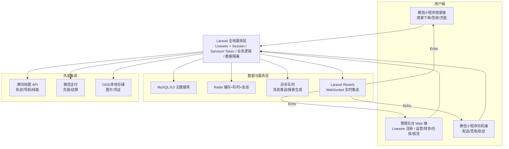
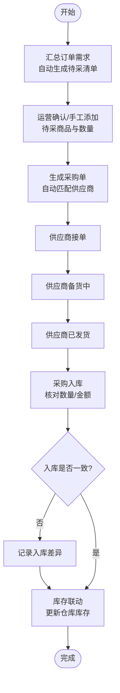
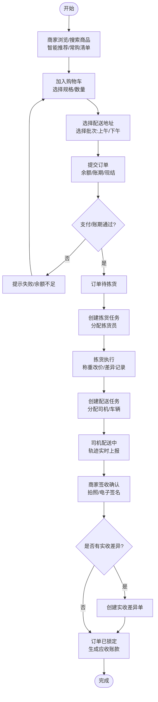
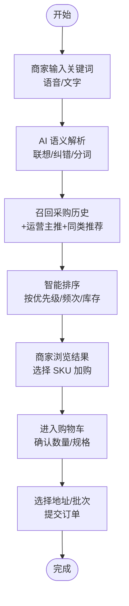
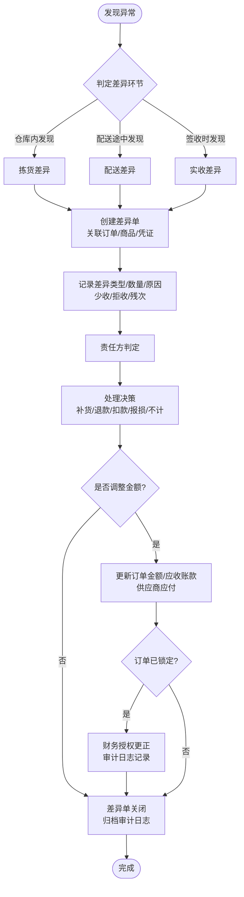
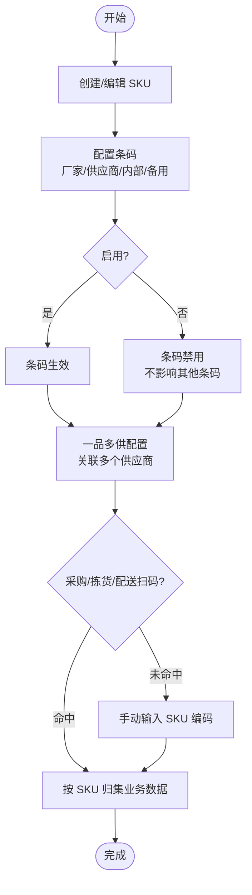
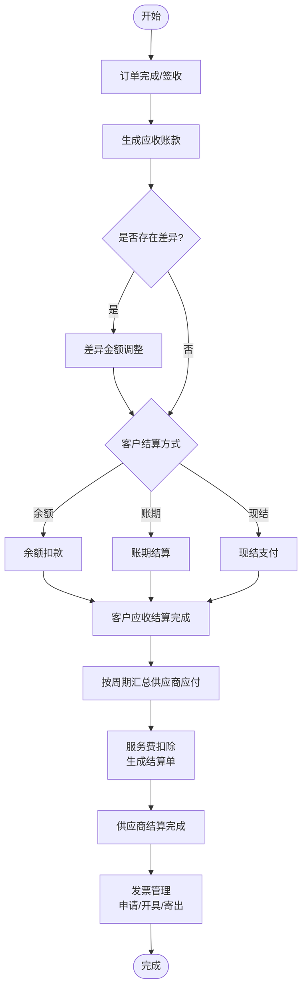
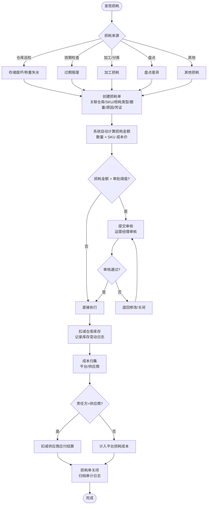

---
AIGC:
  ContentProducer: '001191110102MAD55U9H0F10002'
  ContentPropagator: '001191110102MAD55U9H0F10002'
  Label: '1'
  ProduceID: 'c7094c79-135b-4df1-8014-40b9162c7b2b'
  PropagateID: 'c7094c79-135b-4df1-8014-40b9162c7b2b'
  ReservedCode1: 'cb62bf3f-3daf-472c-b118-2d21f77c1f30'
  ReservedCode2: 'cb62bf3f-3daf-472c-b118-2d21f77c1f30'
---

# PRD 业务需求说明书

项目名称：本地速送服务平台（含生鲜配送）
版本：V1.1
编制日期：2026-07-24
编制人：开发负责人

---

## 1 项目概述

### 1.1 项目背景

本项目为本地生鲜/农产品配送平台，面向 B 端商家（酒店、餐厅）提供食材采购与配送服务。平台核心特点：

- **冷链与非冷链区分**：部分食材需冷链运输，部分常温配送
- **一日两配**：支持上午（午餐批次）和下午（晚餐批次）两次配送
- **称重改价**：生鲜商品按实际称重调整结算金额
- **订单分散**：全天不同时段订货，无明显峰值
- **公司规模小**：人少、并发低，需快速开发演示

### 1.2 建设目标

- 实现商家在线采购、平台统一采购、仓储管理、配送调度全流程数字化
- 支持称重改价、差异处理、财务对账等生鲜行业特有业务
- 管理后台支持运营/财务/拣货/配送等多角色协作
- 微信小程序商家端支持智能搜索、快速复购、补货提醒
- 微信小程序司机端支持配送任务、轨迹上报、拍照签收
- 数据统一存储、操作留痕、审计可追溯
- 预留 AI 智能助手扩展接口（未来迭代）

---

## 2 角色与权限定义

| 角色名称 | 权限范围 | 使用人员 |
| :--- | :--- | :--- |
| 超级管理员 | 全部功能、系统配置、账号管理 | 运维/创始人 |
| 运营管理员 | 商品管理、订单管理、商家管理、供应商管理、运营主推配置、损耗单管理 | 业务主管 |
| 运营经理 | 运营审核、商品/订单/价格策略/损耗单审核确认 | 运营部门负责人 |
| 财务人员 | 应收账款录入、供应商结算录入、发票管理、单据授权更正、审计日志 | 财务专员 |
| 出纳 | 付款录入、收款录入、资金操作执行 | 财务出纳岗 |
| 财务经理 | 财务审核、付款/收款/结算单据复核确认 | 财务部门负责人 |
| 拣货员 | 拣货任务查看/执行、称重改价、拣货差异记录 | 仓库拣货人员 |
| 配送司机 | 配送任务查看/执行、轨迹上报、拍照签收 | 配送司机 |
| 商家 | 商品浏览/搜索/下单、订单查看、收货确认、充值 | 酒店/餐厅采购人员 |

---

## 3 核心业务流程

### 3.1 平台统采流程

待采清单 → 生成采购单 → 供应商接单 → 备货中 → 已发货 → 采购入库 → 完成

### 3.2 客户直采流程（商家下单）

商家搜索/浏览商品 → 加入购物车 → 选择地址/批次 → 提交订单 → 支付 → 待拣货 → 拣货中（称重改价）→ 配送中 → 已签收 → 生成应收账款

### 3.3 智能下单流程（小程序商家端）

输入关键词 → AI 语义解析/联想 → 召回采购历史 + 运营主推 + 同类推荐 → 智能排序展示 → 商家选择加购 → 提交订单

### 3.4 差异处理流程

发现异常 → 判定差异环节（拣货/配送/实收） → 创建差异单 → 记录差异类型/数量/原因/凭证 → 责任方判定 → 处理决策（补货/退款/扣款/报损/不计） → 金额调整 → 更新应收账款/订单金额 → 审计日志归档

统一规则：
- 一个差异单只对应一个环节（拣货、配送、实收），由发现方在对应环节创建。
- 同一订单同一商品在同一环节下，只能存在一个未关闭的差异单；不同环节可按时间顺序依次产生。
- 差异触发优先级：仓库内发现 → 拣货差异；配送途中发现 → 配送差异；商家签收时或签收后规定时效内 → 实收差异。
- 差异处理中若涉及订单金额或应收调整，且订单已签收锁定，需经财务授权更正后方可修改，修改后重新锁定并归档审计日志。
- 差异处理结果同步影响：订单明细金额、商家应收账款、供应商应付结算（如责任方为供应商），争议中差异可暂缓结算。
- 所有差异单的创建、修改、金额调整、关闭均进入审计日志。

### 3.5 条码管理流程

SKU 创建/编辑 → 配置条码信息（厂家条码、供应商条码、内部条码、备用条码） → 设置启用/禁用状态 → 采购/拣货/配送环节扫码识别 → 库存变动与订单明细按 SKU 归集

统一规则：
- 条码为可选配置：每个 SKU 可以不配置条码，也可以配置一个或多个条码；任一条码可单独启用或禁用，禁用后不影响其他条码使用。
- 条码类型：厂家条码、供应商条码、内部条码、备用条码。供应商条码需关联具体供应商，用于一品多供场景。
- 一品多供：一个 SKU 可关联多个供应商，分别设置默认供应商、采购参考价、启用状态和排序；生成采购单时优先取默认供应商，运营可手动切换。
- 条码唯一性：同一 SKU 下，同类型同供应商的条码不可重复；不同 SKU 可允许相同条码（按实际业务允许一品一码或一码多品）。
- 条码使用场景：采购入库、拣货出库、库存盘点、配送交接、售后退货等环节均可通过扫码快速定位 SKU，扫码未命中时支持手动输入 SKU 编码。

### 3.6 财务结算流程

订单完成 → 生成应收账款 → 差异调整（如有）→ 客户结算（余额/账期/现结）→ 供应商结算（按周期汇总）

**多次付款/收款与办结规则：**

- 应收账款和应付账款均支持多次部分收款/付款，每笔收款/付款单独记录（金额、方式、时间、操作人、凭证）。
- 金额结清判定：当"已收金额 ≥ 应收金额"时，系统判定该笔应收账款已结清；当"已付金额 ≥ 应付金额"时，系统判定该笔应付账款已结清。
- 自动办结提示：金额结清后，系统弹窗提示"金额已结清，是否自动办结？"，用户确认后单据状态变更为"已办结"。
- 手动办结：用户也可在单据详情页手动点击"办结"按钮触发办结。办结时系统校验"已收/已付金额 ≥ 应收/应付金额"，不满足则拒绝并提示差额。
- 办结后单据不可再进行收款/付款操作（审计日志记录办结操作）。

### 3.7 损耗管理流程

发现损耗 → 创建损耗单（记录损耗类型/数量/金额/原因/凭证）→ 审核（超阈值时触发审批）→ 扣减库存 → 成本归集（平台/供应商）→ 损耗单关闭 → 归档审计日志

统一规则：
- 损耗单关联仓库、SKU，记录损耗类型（存储腐坏、称重失水、过期报废、加工损耗、盘点差异、其他）和数量。
- 损耗金额自动计算：损耗数量 × SKU 财务成本价。
- 损耗审批阈值：损耗金额超过系统配置的阈值（`loss_approval_threshold`，默认 200 元）时，需运营经理审核通过后方可执行；未超阈值时直接执行。
- 成本归集：损耗成本归集到指定责任方（1 平台，2 供应商），供应商损耗自动扣减供应商应付结算。
- 库存联动：审核通过（或无需审核时直接执行）后扣减对应仓库库存，记录库存变动日志（变动类型=报损）。
- 所有损耗单的创建、修改、审核、关闭均进入审计日志。

### 3.8 审核管理规则

> 系统提供**可配置的审核机制**，每个审核节点支持独立开关。节点关闭时，业务操作直接生效；节点开启时，操作需经指定角色审核后方可生效。管理员可通过"审核管理→审核配置"菜单按需开启/关闭审核节点，并配置申请人角色和审核人角色。

#### 3.7.1 审核节点清单

> 按风险等级分级。P0 为资金直接流出/流入，P1 为影响金额计算/结算，P2 为间接影响金额/业务准确性。

| 序号 | 审核节点 | 类型编码 | 风险等级 | 所属模块 | 默认状态 | 申请人角色 | 审核人角色 | 审核通过后动作 |
| :--- | :--- | :--- | :--- | :--- | :--- | :--- | :--- | :--- |
| 1 | 后台手工充值 | `manual_recharge` | P0 | 财务对账 | 开启 | 运营管理员 | 财务经理 | 充值金额入账，更新商家账户余额 |
| 2 | 供应商付款录入 | `supplier_payment` | P0 | 财务对账 | 开启 | 出纳 | 财务经理 | 更新结算单已付金额，触发结清/办结判定 |
| 3 | 客户收款录入 | `customer_receipt` | P0 | 财务对账 | 开启 | 出纳 | 财务经理 | 更新应收已收金额，触发结清/办结判定 |
| 4 | 信用额度调整 | `credit_limit` | P0 | 商家管理 | 开启 | 运营管理员 | 财务经理 | 信用额度生效，影响账期下单限额 |
| 5 | 价格策略创建/修改 | `price_strategy` | P0 | 价格策略 | 开启 | 运营管理员 | 财务经理 | 策略生效，影响后续订单金额计算 |
| 6 | 手动均摊调整 | `manual_apportion` | P0 | 费用均摊 | 开启 | 财务人员 | 运营经理 | 均摊金额生效，更新订单/采购单金额 |
| 7 | 差异退款/扣款决策 | `diff_refund_deduct` | P0 | 差异处理 | 开启 | 运营管理员 | 财务经理 | 执行退款/扣款，更新应收/应付金额 |
| 8 | SKU 批发价修改(>15%) | `sku_price_change` | P1 | 商品管理 | 开启 | 运营管理员 | 运营经理 | 价格生效，影响后续下单金额 |
| 9 | 应收改价折扣调整 | `receivable_adjust` | P0 | 财务对账 | 开启 | 运营管理员 | 财务经理 | 应收金额调整生效 |
| 10 | 商家充值确认 | `recharge_confirm` | P0 | 财务对账 | 开启 | 运营管理员 | 财务经理 | 充值到账，更新商家账户余额 |
| 11 | 采购退货 | `purchase_return` | P0 | 平台统采 | 关闭 | 运营管理员 | 财务经理 | 扣减库存和应付，执行退货退款 |
| 12 | 售后退货退款 | `after_sale_return` | P0 | 客户直采 | 关闭 | 运营管理员 | 财务经理 | 扣减应收，退余额/信用额度 |
| 13 | 单据授权更正 | `auth_correction` | P0 | 财务对账 | 关闭 | 财务人员 | 财务经理 | 解锁已锁定数据允许更正 |
| 14 | 称重改价(≤20%) | `weighing_price` | P1 | 客户直采 | 关闭 | 拣货员 | 运营经理 | 称重改价金额生效 |
| 15 | 采购入库确认 | `purchase_warehouse` | P1 | 平台统采 | 关闭 | 运营管理员 | 运营经理 | 入库数量/金额确认，触发库存联动 |
| 16 | 供应商银行信息修改 | `supplier_bank_edit` | P1 | 组织主体 | 关闭 | 运营管理员 | 财务经理 | 银行收付款信息生效 |
| 17 | 手动办结 | `manual_close` | P1 | 财务对账 | 关闭 | 财务人员 | 财务经理 | 单据办结锁定，不可再付款/收款 |
| 18 | SKU小幅改价(≤15%) | `sku_price_minor` | P1 | 商品管理 | 关闭 | 运营管理员 | 运营经理 | 价格生效 |
| 19 | 损耗单审核 | `loss_order` | P1 | 损耗管理 | 开启 | 运营管理员 | 运营经理 | 损耗单生效，扣减库存，成本归集 |

#### 3.7.2 审核运行机制

1. **开关判定**：业务操作触发时，查询 `approval_type_configs` 表对应节点的 `enabled` 状态：
   - `enabled = 0`（关闭）：操作直接执行，不走审批流程
   - `enabled = 1`（开启）：操作进入"待审核"状态，生成审批记录
2. **审批拦截**：开启审核的节点，业务数据 `approval_status = 1`（待审核），不生效；审批通过后 `approval_status = 2`，执行业务动作
3. **通知机制**：审批记录生成后，系统通知审核人角色下的所有用户（站内通知 + 角标提醒）
4. **开关切换规则**：
   - 开启→关闭：不影响已存在的待审核单据，在途单据按原规则走完；新单据不再走审核
   - 关闭→开启：新创建的单据开始走审核，已完成的单据不受影响
5. **超级管理员**：可代行任何审核角色
6. **审计追溯**：所有审核操作（通过/拒绝/代行）均写入审计日志

#### 3.7.3 通用规则

- 审核拒绝时需填写拒绝原因，操作人可修改后重新提交。
- 审核节点配置（开关、角色）变更写入审计日志。

---

## 4 系统模块范围

### 4.1 管理后台 Web 端（Livewire 4.x + Alpine.js + Tailwind CSS + Blade）

1. **用户与权限管理模块** — 用户、角色、权限、RBAC
2. **组织主体管理模块** — 供应商、商家、配送线路、司机、车辆
3. **商品管理模块** — 分类、商品、SKU 规格、条码管理（厂家条码/供应商条码/内部条码/备用条码，可任意启用禁用）、一品多供配置（SKU 与多供应商关联）、可见性白名单、关键词标签
4. **平台统采模块** — 待采清单、采购单、采购入库、采购退货
5. **客户直采模块** — 购物车、订单管理、订单明细、常购清单、一键复购、售后退货
6. **库存管理模块** — 仓库、实时库存、库存变动日志、库存预警
7. **拣货管理模块** — 拣货任务、拣货执行
8. **物流配送模块** — 配送任务、收货地址、配送轨迹、签收存证
9. **差异处理模块** — 统一差异单管理、拣货差异处理、配送差异处理、实收差异处理、差异金额调整与审批、差异报表
10. **财务对账模块** — 客户账户、充值、供应商结算、多次付款/收款、应收账款、应付账款、发票、单据授权更正、费用均摊、自动办结与手动办结
11. **价格策略模块** — 促销策略、临时改价、改价记录
12. **系统支撑模块** — 系统配置管理（独立菜单）、轮播广告、运营主推配置、操作日志、登录日志、审计日志、队列与缓存
13. **审核管理模块** — 审核配置（节点开关、申请人/审核人角色可配，19 个节点，见 3.7）、待审核列表、审核操作、审核记录
14. **损耗管理模块** — 损耗单管理（申报→审核→扣减库存→成本归集）、损耗审批（纳入审核体系，见 3.7）、库存变动联动、损耗报表（按品类/仓库/时段统计损耗率与损耗金额）
15. **审计模块** — 登录审计（账号/IP/结果/客户端）、敏感操作审计（删除、结算、授权更正、配置修改，含修改前后数据与 IP）、审计数据保留 0–180 天可配置（0=永久）、到期自动清理

### 4.2 微信小程序商家端（Taro 4 + React + TypeScript）

1. 微信用户绑定 / 登录
2. 商品智能搜索下单（关键词联想 + 采购历史关联）
3. 购物车管理
4. 订单创建与查看
5. 收货确认
6. 充值
7. 常购清单 / 收藏商品
8. 智能补货提醒

### 4.3 微信小程序司机端（原生开发）

1. 配送任务接收
2. 导航 / 轨迹上报
3. 拍照签收 / 电子签名
4. 冷链温度记录

---

## 5 技术栈

### 5.1 后端

| 技术 | 版本 | 说明 | 使用场景（匹配功能） |
| :--- | :--- | :--- | :--- |
| Laravel | 13.x | 主框架 | 路由、业务逻辑、数据校验、定时任务、服务端渲染 |
| Livewire | 4.x | 全栈响应式框架 | 管理后台服务端渲染、组件化页面、表单交互、看板拖拽 |
| PHP | 8.3+（推荐 8.5） | 运行环境 | 匹配 Laravel 13 要求 |
| MySQL | 8.0 | 主数据库 | 订单、库存、结算等事务数据；JSON 字段存扩展属性 |
| Redis | 7.x | 缓存 + 队列 + 会话 | ① 缓存：商品列表、系统配置、字典数据 ② 队列：订单通知、报表导出、批量任务 ③ 会话：管理后台 Session 存储 ④ 分布式锁：库存扣减防超卖 ⑤ 限流：API 频率限制 |
| Laravel Sanctum | 最新 | API Token 认证 | 小程序端（商家端/司机端）登录认证 |
| Spatie Permission | 最新 | RBAC 角色权限 | 菜单/按钮级权限，角色动态渲染侧边栏 |
| cknow/laravel-money | ^8.5 | 金额整数存储 | 底层 brick/money，数据库 bigint 存分/厘/毫，Model Cast 自动转换，杜绝浮点精度丢失 |
| Laravel Queue | 内置 | 异步任务 | 短信/消息通知、Excel 导出、对账任务 |
| Laravel Reverb | 1.x | WebSocket 实时推送服务器 | ① 订单状态变更实时推送到管理后台 ② 配送轨迹实时推送 ③ 审核待办即时通知 ④ 库存预警弹窗 ⑤ 小程序端消息推送（通过 Laravel Echo） |

### 5.2 管理后台 Web 端

| 技术 | 说明 | 使用场景（匹配功能） |
| :--- | :--- | :--- |
| Livewire | 4.x | 全栈响应式框架，服务端渲染管理后台全部页面，组件化开发 |
| Alpine.js | 内置（Livewire 4.x 捆绑） | 客户端轻量交互：下拉、弹窗、Drawer、Toast、拖拽辅助 |
| Tailwind CSS | 4.2+ | 原子化样式基座，承载主题 token，手写 UI 组件 |
| Blade | Laravel 模板引擎 | 自定义组件（零第三方 UI 依赖、零许可证），对标 shadcn/ui 风格 |
| wire:sort / wire:sort:group | Livewire 4.x 内置 | 看板拖拽排序、跨列拖拽状态流转 |
| 腾讯地图 JS API | 配送轨迹、线路规划 | 配送调度地图、司机轨迹回放 |

### 5.3 微信小程序

| 端 | 技术 | 使用场景（匹配功能） |
| :--- | :--- | :--- |
| 商家端 | Taro 4 + React + TypeScript | 智能搜索下单、购物车、订单查看、签收确认、充值 |
| 司机端 | 原生微信小程序 | 配送任务接收、导航、轨迹上报、拍照签收、冷链温度记录 |

### 5.4 前端主题规范（shadcn/ui 风格 + Tailwind 手写）

管理后台遵循 shadcn/ui 的**设计理念**（Open Code 开源可控、Composition 可组合接口、Beautiful Defaults 精心挑选的默认样式、AI-Ready LLM 可读可改），使用 **Tailwind CSS 4.x `@theme` 指令 + CSS 变量**实现同款 token 体系，Blade 组件对标 shadcn/ui 的可组合结构。整体风格为**小圆角、小字体、小按钮**；全局反馈与通知统一使用 Toast（Alpine.js）+ 右侧 Drawer：

1. **主题机制**：Blade 组件全部读取 CSS 变量（`--background`、`--primary`、`--radius` 等），Tailwind 4.x 通过 `@theme` 指令映射 token，改一处变量全局生效
2. **语义化 token 体系**：background/foreground、card/card-foreground、popover/popover-foreground、primary/primary-foreground、secondary/secondary-foreground、muted/muted-foreground、accent/accent-foreground、destructive、border/input/ring、sidebar 系列、chart-1~5
3. **基础颜色可配置**：在 CSS 变量层直接修改 oklch/HSL 色值即可切换主题基色，支持 `:root` 与 `.dark` 双主题
4. **圆角尺度可配置**：以 `--radius` 为基准值派生 sm/md/lg/xl/2xl/3xl/4xl 六级圆角（乘数 0.6~2.6），一处修改全局联动
5. **小圆角**：`--radius: 0.25rem`（4px）
6. **小字体**：默认 M 档——正文/按钮 14px，辅助/表格/badge 13px，区块标题 16px，页面标题 19px，统计数字 22px，信息密度优先（S/L 档完整数值见 Setup 6.5.2）
7. **小按钮**：默认 M 档——按钮高 32px、列表操作按钮高 26px、字号 14px（S 档 30/24px，L 档 36/30px），与表格/表单的紧凑布局匹配
8. **轻提醒（Toast）**：基于 Alpine.js 实现统一 Toast，代替浏览器 alert，保持样式与动效一致
9. **通知中心**：站内消息/系统通知统一采用右侧滑出的 Drawer 面板展示（Livewire 组件 + Alpine.js），入口位于顶部导航栏，宽度默认 360px，小圆角
10. **尺寸档位可配置**：字体与图标支持 S / M / L 三档（**系统默认 M 档**：正文 14px、图标 16px、按钮 32px）；通过 `.env` 配置 `UI_SIZE=S|M|L` 同步修改系统所有字体、图标与按钮尺寸，实现上通过 `<html data-size>` 切换 CSS 尺寸变量全站生效；开发**优先组件化**，Blade 组件对标 shadcn/ui 可组合结构（如 Card = CardHeader + CardContent + CardFooter，Button 支持 default/outline/ghost/destructive/secondary/link 变体 + xs/sm/default/lg/icon 尺寸），组件尺寸引用 token、禁止写死 px；完整颜色与尺寸数值见《05 Setup 安装部署配置手册》第 6.5、6.6 节
11. 具体配置代码见《05 Setup 安装部署配置手册》第 6 节「管理后台主题配置」

---

## 6 非功能性需求

### 6.1 性能

- 管理后台页面首屏加载 ≤ 2 秒
- API 接口响应时间 ≤ 500ms（P95）
- 支持 100 人同时在线管理后台
- 小程序页面切换流畅，无明显卡顿

### 6.2 兼容性

- 管理后台：Chrome / Edge / Safari 最新两个大版本
- 小程序：微信基础库 2.30.0+

### 6.3 安全性

- 密码 bcrypt 加密存储
- 管理后台：Session 认证（Laravel 内置）；小程序端：Sanctum Token 认证
- 敏感操作（删除、结算、授权更正）二次确认
- 操作日志不可删除，审计日志完整记录修改前后数据；登录行为全量审计（账号、IP、结果）；审计数据保留 0–180 天可配置（0=永久），到期自动清理
- 商家数据隔离（按 merchant_id 自动过滤）

### 6.4 可维护性

- RESTful API 设计规范（小程序端）；管理后台采用 Livewire 组件路由
- 数据库迁移文件可复现
- 配置参数化（system_configs 表）
- 支持快速迭代，预留 AI 扩展接口

### 6.5 实时推送规范（Laravel Reverb + Echo）

系统使用 **Laravel Reverb** 作为 WebSocket 服务器，配合 **Laravel Echo**（前端）实现全站实时推送能力：

**推送场景与频道规划：**

| 场景 | 频道类型 | 频道名称 | 触发时机 | 接收端 |
| :--- | :--- | :--- | :--- | :--- |
| 订单状态变更 | Private | `orders.{merchant_id}` | 订单状态流转时 | 管理后台（Livewire）、商家端小程序 |
| 审核待办通知 | Private | `approval.{role_id}` | 新审核单创建时 | 管理后台（对应角色用户） |
| 配送轨迹更新 | Private | `delivery.{driver_id}` | 司机上报轨迹时 | 管理后台调度页 |
| 库存预警弹窗 | Private | `inventory.warning` | 库存低于预警值时 | 管理后台（运营/仓库） |
| 差异单创建通知 | Private | `discrepancy.{merchant_id}` | 差异单创建时 | 管理后台、商家端小程序 |
| 损耗审核通知 | Private | `loss-order.pending` | 损耗单提交审核时 | 管理后台（运营经理） |
| 充值到账通知 | Private | `recharge.{merchant_id}` | 充值审核通过时 | 商家端小程序 |
| 全局系统公告 | Public | `system.announcement` | 超管发布公告时 | 全部在线用户 |

**管理后台集成方式（Livewire + Echo）：**

- Livewire 组件通过 `wire:listen` 或 Alpine.js 监听 Echo 事件，实现页面内局部更新（无需整页刷新）
- 通知面板（右侧 Drawer）实时接收未读消息，角标动态更新
- 看板页面（配送调度、拣货看板）实时更新卡片状态与位置

**小程序端集成方式（Laravel Echo + 小程序 WebSocket）：**

- 商家端/司机端通过 `laravel-echo` + `pusher-js`（兼容 Reverb 协议）连接 WebSocket
- 小程序端使用 `wx.connectSocket` 适配或第三方封装库桥接 Echo
- 断线自动重连，后台切换时恢复连接

**安全与权限：**

- Private 频道需通过 `/api/broadcasting/auth` 授权（管理后台 Session 认证 / 小程序 Token 认证）
- 用户只能订阅自己有权限的频道（商家只能订阅自己的 `orders.{merchant_id}`）
- Presence 频道可用于在线状态展示（如司机在线状态）

**部署要求：**

- Reverb 服务独立进程运行（Supervisor 管理），默认端口 8080
- Nginx 反向代理 WebSocket 连接（`/app` 路径 → Reverb 端口）
- Redis 作为广播驱动（`BROADCAST_DRIVER=redis`）

---

## 7 交付验收标准

1. 全部需求功能可正常操作，无阻断性 BUG
2. 管理后台 + 小程序商家端 + 小程序司机端三端联调通过
3. 核心业务流程跑通：商家下单 → 拣货 → 配送 → 签收 → 结算
4. Laravel Reverb WebSocket 实时推送正常，订单/审核/配送/库存预警推送可达
5. 部署文档完整，可全新服务器一键安装
6. 数据字典、接口文档齐全
7. 提供基础初始化数据脚本（角色、管理员账号、系统配置）

## 8 系统流程图

> 以下流程图采用 Mermaid 语法，可在 GitHub、GitLab、Typora 等支持 Mermaid 的 Markdown 环境中直接渲染。对应的可编辑 `.drawio` 源文件位于 `docs/flowcharts/draw 03/` 目录，主合并文件为 `docs/flowcharts/draw 03.drawio`，可用 [draw.io / diagrams.net](https://app.diagrams.net) 打开修改。

### 8.1 整体系统业务架构图

### 8.2 平台统采流程

### 8.3 客户直采流程

### 8.4 智能下单流程

### 8.5 差异处理流程

### 8.6 条码管理流程

### 8.7 财务结算流程

### 8.8 损耗管理流程

### 8.9 流程图源文件清单

> 以下 `.drawio` 源文件位于 `docs/flowcharts/draw 03/` 目录，主合并文件为 `docs/flowcharts/draw 03.drawio`，可用 [draw.io / diagrams.net](https://app.diagrams.net) 打开修改。

| 文件名 | 对应内容 | 适用场景 |
| :--- | :--- | :--- |
| `01_整体系统业务架构图.drawio` | 三端 + API + 数据层 + 外部集成 | 技术架构评审、部署说明 |
| `02_平台统采流程.drawio` | 待采清单 → 采购入库 | 供应商/采购模块开发 |
| `03_客户直采流程.drawio` | 商家下单 → 签收 → 应收账款 | 订单/配送/财务核心流程 |
| `04_智能下单流程.drawio` | 小程序 AI 搜索推荐加购 | 商家端智能下单模块 |
| `05_差异处理流程.drawio` | 差异判定 → 处理 → 归档 | 差异处理/财务审计模块 |
| `06_条码管理流程.drawio` | SKU 条码配置 → 一品多供 → 扫码识别 | 商品/采购/库存/拣货模块开发 |
| `07_财务结算流程.drawio` | 应收/供应商结算/发票 | 财务对账模块 |
| `08_库存管理流程.drawio` | 入库/出库/调整/预警/效期 | 库存管理模块开发 |
| `09_拣货管理流程.drawio` | 拣货任务 → 称重改价 → 差异 | 拣货管理模块开发 |
| `10_物流配送流程.drawio` | 配送任务 → 导航 → 签收 | 物流配送模块开发 |
| `11_微信小程序商家端流程.drawio` | 商家下单全流程 | 小程序商家端 UX |
| `12_微信小程序司机端流程.drawio` | 司机配送全流程 | 小程序司机端 UX |
| `13_权限与数据隔离流程.drawio` | RBAC + 数据隔离 | 权限管理模块开发 |
| `14_商品管理流程.drawio` | 分类 → SKU → 条码 → 一品多供 → 可见性 → 标签 | 商品管理模块开发 |
| `15_损耗管理流程.drawio` | 损耗申报 → 审批阈值 → 库存扣减 → 成本归集 | 损耗管理模块开发 |
| `16_价格策略流程.drawio` | 创建策略 → 审核 → 生效 → 改价记录 → 费用均摊 | 价格策略模块开发 |
| `17_退货管理流程.drawio` | 采购退货 + 售后退货双分支 | 退货管理模块开发 |
| `18_审核管理流程.drawio` | 19个审核节点统一流转 | 审核管理模块开发 |
| `19_用户与权限管理流程.drawio` | 角色 → 权限 → 用户 → 登录 → 数据隔离 | 用户与权限管理模块开发 |

> AI生成