---
AIGC:
  ContentProducer: '001191110102MAD55U9H0F10002'
  ContentPropagator: '001191110102MAD55U9H0F10002'
  Label: '1'
  ProduceID: '8e993514-ef9a-4db1-8774-68b28653a8e0'
  PropagateID: '8e993514-ef9a-4db1-8774-68b28653a8e0'
  ReservedCode1: '1b4e2b23-68d6-4a3a-88a2-319e76d69f53'
  ReservedCode2: '1b4e2b23-68d6-4a3a-88a2-319e76d69f53'
---

# FSD 功能详细说明书

对应 PRD 版本：V1.0
技术栈：Laravel 13 + Livewire 4.x + Alpine.js + Tailwind CSS 4.2+ + Blade 自定义组件 + MySQL 8.0 + Redis 7.x

*FSD*（Functional Specifications Document），中文名为*功能详细说明*，是定义产品功能需求全部细节的设计文档。该文档通过产品界面截屏和功能点描述明确产品规格，是工程师可直接用于创建产品的技术文件。

---

## 1 公共通用功能（全局）

### 1.1 登录页

1. 账号（用户名/手机号/邮箱）+ 密码登录
2. 图形验证码防暴力破解
3. 记住登录状态 7 天（Token 自动续期）
4. 登录失败提示：账号不存在 / 密码错误 / 账号禁用
5. 登录成功跳转首页；登录错误记录日志
6. 密码重置：发送验证码到绑定手机/邮箱

### 1.2 全局布局（顶部导航 + 侧边菜单 + 内容区）

1. 侧边栏按角色动态渲染菜单（无权限菜单隐藏）
2. 菜单支持展开/折叠，刷新后保持折叠状态
3. 顶部栏：面包屑导航、消息通知入口（点击后唤起右侧 Drawer 通知面板）、全局搜索框
4. 右上角：当前用户头像/名称下拉菜单（个人资料、修改密码、退出登录）
5. 内容区：Tab 页签支持多页面切换（可选）

### 1.3 通用数据表格组件

统一能力：
- 分页（支持页码跳转 + 每页条数选择）
- 多条件筛选（文本搜索、下拉选择、日期范围、状态筛选）
- 列显示/隐藏配置
- 排序（单击表头排序）
- 批量操作（批量删除、批量导出）
- 单条操作（查看详情、编辑、删除）
- 导出 Excel（按需支持批量导入）
- 空数据状态展示
- 加载骨架屏

### 1.4 通用表单组件

- 表单校验：必填项红色提示，阻止提交
- 提交 loading 状态，防重复点击
- 文件上传（图片压缩、预览）
- 日期时间选择器
- 金额输入（保留两位小数）
- 下拉选择（支持搜索、多选）
- 富文本编辑器（商品详情等场景）
- 新增、更新、删除等轻提醒统一使用 Toast（Alpine.js 驱动）提示，删除或敏感操作使用确认弹窗（Blade Modal）；按钮默认小尺寸（`size="sm"`），与紧凑布局匹配。

### 1.5 异常处理统一规范

- 后端接口 500 错误：统一使用 Toast 提示"系统异常，请稍后重试"
- 401 未授权：自动跳转登录页（Livewire 中间件处理）
- 403 无权限：提示"无权访问"
- 404 页面不存在：Livewire 404 页面
- 数据删除：二次确认弹窗
- 表单提交失败：Livewire 自动显示校验错误，聚焦到第一个错误字段

---

## 2 各模块详细功能

### 2.1 用户与权限管理模块

#### 2.1.1 用户管理

| 功能点 | 说明 |
| :--- | :--- |
| 用户列表 | 分页展示，支持按用户名/手机号/角色/状态筛选 |
| 新增用户 | 填写用户名、密码、姓名、手机号、邮箱、角色、状态 |
| 编辑用户 | 修改姓名、手机号、邮箱、角色、状态；用户名不可修改 |
| 重置密码 | 管理员一键重置为初始密码，用户首次登录强制修改 |
| 禁用/启用 | 禁用后无法登录，保留历史数据；可重新启用 |
| 删除用户 | 软删除（保留数据），超级管理员不可删除 |
| 用户详情 | 展示基本信息、角色、创建时间、最后登录时间 |

#### 2.1.2 角色管理

| 功能点 | 说明 |
| :--- | :--- |
| 角色列表 | 展示系统预设角色（超级管理员、运营管理员、运营经理、财务人员、出纳、财务经理、拣货员、配送司机、商家） |
| 新增角色 | 填写角色名称、标识、备注 |
| 编辑角色 | 修改角色信息 |
| 删除角色 | 已被用户绑定的角色不可删除 |
| 权限配置 | 为角色勾选权限（树形结构：模块 → 页面 → 按钮） |

#### 2.1.3 权限管理

| 功能点 | 说明 |
| :--- | :--- |
| 权限列表 | 树形展示所有权限节点 |
| 新增权限 | 填写权限名称、标识（route）、类型（菜单/按钮）、上级权限、排序 |
| 编辑权限 | 修改权限信息 |
| 删除权限 | 已被角色引用的权限不可删除 |

#### 2.1.4 数据隔离

- 商家相关数据查询自动注入 `where('merchant_id', ...)`
- 司机只能查看自己的配送任务
- 拣货员只能查看分配给自己的拣货任务

---

### 2.2 组织主体管理模块

#### 2.2.1 供应商管理

| 功能点 | 说明 |
| :--- | :--- |
| 供应商列表 | 分页展示，支持按名称/联系人/状态筛选 |
| 新增供应商 | 名称、联系人、联系电话、地址、银行收付款信息、结算周期（周结/月结） |
| 编辑供应商 | 修改信息 |
| 删除供应商 | 有关联采购单的不可删除 |
| 供应商详情 | 基本信息 + 历史采购单列表 |

#### 2.2.2 商家管理

| 功能点 | 说明 |
| :--- | :--- |
| 商家列表 | 分页展示，支持按名称/线路/结算方式筛选 |
| 新增商家 | 名称、配送地址、所属线路、配送顺序、起送价、结算方式（现结/账期/预付款）、信用额度 |
| 编辑商家 | 修改信息 |
| 删除商家 | 有关联订单的不可删除 |
| 商家详情 | 基本信息 + 历史订单 + 账户余额 + 应收账款 |

#### 2.2.3 配送线路管理

| 功能点 | 说明 |
| :--- | :--- |
| 线路列表 | 展示所有配送线路 |
| 新增线路 | 线路名称、描述 |
| 编辑线路 | 修改信息 |
| 商家排序 | 在线路下调整商家的配送顺序（拖拽排序） |

#### 2.2.4 司机管理

| 功能点 | 说明 |
| :--- | :--- |
| 司机列表 | 分页展示，支持按姓名/手机号/在线状态筛选 |
| 新增司机 | 姓名、手机号、身份证号 |
| 编辑司机 | 修改信息 |
| 在线状态 | 查看司机当前在线/离线状态 |
| 司机详情 | 基本信息 + 绑定车辆 + 历史配送任务 |

#### 2.2.5 车辆管理

| 功能点 | 说明 |
| :--- | :--- |
| 车辆列表 | 展示所有车辆 |
| 新增车辆 | 车牌号、车辆类型、冷链/非冷链 |
| 编辑车辆 | 修改信息 |
| 绑定司机 | 车辆与司机关联/解绑 |

---

### 2.3 商品管理模块

#### 2.3.1 商品分类管理

| 功能点 | 说明 |
| :--- | :--- |
| 分类列表 | 树形展示无限极分类 |
| 新增分类 | 名称、上级分类、图标、排序 |
| 编辑分类 | 修改信息 |
| 删除分类 | 有子分类或有商品的不可删除 |
| 分类状态 | 启用/禁用 |

#### 2.3.2 商品管理

| 功能点 | 说明 |
| :--- | :--- |
| 商品列表 | 分页展示，支持按名称/分类/供应商/状态筛选 |
| 新增商品 | 名称、分类、封面图、单位（斤/箱/份）、是否称重改价、供应商、库存预警值、状态 |
| 编辑商品 | 修改信息 |
| 商品多图 | 上传多张详情图，支持排序 |
| 商品上下架 | 启用/禁用 |
| 商品详情 | 基本信息 + SKU 列表 + 可见性配置 |

#### 2.3.3 SKU 规格管理

| 功能点 | 说明 |
| :--- | :--- |
| SKU 列表 | 在商品详情页展示该商品的所有 SKU |
| 新增 SKU | 规格属性、规格值、采购参考价、批发销售价、财务成本价、库存 |
| 编辑 SKU | 修改信息；**修改批发销售价幅度 > 15% 时，需运营经理审核通过后方可生效** |
| 删除 SKU | 有订单关联的不可删除 |

#### 2.3.4 商品可见性配置

| 功能点 | 说明 |
| :--- | :--- |
| 白名单配置 | 按商家勾选可购买的 SKU |
| 批量配置 | 为多个商家批量设置可见商品 |

#### 2.3.5 商品关键词标签

| 功能点 | 说明 |
| :--- | :--- |
| 关键词配置 | 为商品配置搜索关键词、品类标签 |
| 标签管理 | 维护标签词库，支撑智能搜索联想 |

#### 2.3.6 SKU 条码管理

| 功能点 | 说明 |
| :--- | :--- |
| 条码列表 | 在 SKU 详情页展示该 SKU 的所有条码（厂家/供应商/内部/备用） |
| 新增条码 | 选择条码类型、输入条码值；供应商条码需关联具体供应商 |
| 编辑条码 | 修改条码信息 |
| 启用/禁用 | 任一条码可单独启用或禁用，禁用后不影响其他条码使用 |
| 删除条码 | 删除条码（软删除） |
| 默认条码 | 设置默认条码，扫码时优先匹配 |
| 扫码识别 | 采购入库、拣货出库、库存盘点、配送交接等环节扫码快速定位 SKU |
| 手动输入 | 扫码未命中时支持手动输入 SKU 编码 |

统一规则：
- 条码为可选配置：每个 SKU 可以不配置条码，也可以配置一个或多个条码；任一条码可单独启用或禁用，禁用后不影响其他条码使用。
- 条码类型：1 厂家条码、2 供应商条码、3 内部条码、4 备用条码。供应商条码需关联具体供应商，用于一品多供场景。
- 条码唯一性：同一 SKU 下，同类型同供应商的条码不可重复；不同 SKU 可允许相同条码（按实际业务允许一品一码或一码多品）。
- 条码使用场景：采购入库、拣货出库、库存盘点、配送交接、售后退货等环节均可通过扫码快速定位 SKU。

#### 2.3.7 一品多供配置

| 功能点 | 说明 |
| :--- | :--- |
| 供应商关联列表 | 在 SKU 详情页展示该 SKU 关联的所有供应商 |
| 新增关联 | 选择供应商、设置采购参考价、是否默认、排序 |
| 编辑关联 | 修改采购参考价、排序 |
| 默认供应商 | 设置默认供应商，生成采购单时优先取默认供应商 |
| 启用/禁用 | 禁用后该供应商不参与自动匹配，可手动切换 |
| 删除关联 | 删除供应商关联（有关联采购单的不可删除） |

统一规则：
- 一个 SKU 可关联多个供应商，实现一品多供。
- 采购单生成时优先取默认供应商，运营可手动切换。
- 同一 SKU 同一供应商不可重复关联。

---

### 2.4 平台统采模块

#### 2.4.1 待采清单

| 功能点 | 说明 |
| :--- | :--- |
| 待采列表 | 展示所有待采商品，支持按商品/状态筛选 |
| 自动汇总 | 根据订单商品汇总，自动生成待采需求 |
| 手工添加 | 手动添加待采商品和数量 |
| 生成采购单 | 勾选待采项，生成采购单（自动匹配供应商） |
| 待采状态 | 待生成 / 已生成采购单 |

#### 2.4.2 采购单管理

| 功能点 | 说明 |
| :--- | :--- |
| 采购单列表 | 分页展示，支持按单号/供应商/状态筛选 |
| 采购单详情 | 基本信息 + 商品明细 |
| 状态流转 | 待接单 → 备货中 → 已发货 → 已入库 → 完成 |
| 状态操作 | 供应商接单、确认发货、确认入库 |
| 取消采购单 | 待接单状态下可取消 |

#### 2.4.3 采购入库管理

| 功能点 | 说明 |
| :--- | :--- |
| 入库操作 | 在采购单详情页执行入库 |
| 入库记录 | 实际入库数量、实际金额、操作人、入库时间 |
| 入库差异 | 实际入库与采购数量不一致时，记录差异原因 |
| 库存联动 | 入库后自动更新对应仓库库存 |

#### 2.4.4 采购退货管理

| 功能点 | 说明 |
| :--- | :--- |
| 退货单列表 | 分页展示，支持按单号/供应商/状态筛选 |
| 新增退货单 | 关联采购单，选择退货商品和数量 |
| 退货明细 | SKU、退货数量、退货单价、退货金额、退货原因 |
| 退货审核 | 待审核 → 已审核 → 已出库 → 完成；可取消 |
| 实际出库 | 记录实际出库数量、出库单价、出库金额 |
| 库存联动 | 审核通过后扣减对应仓库库存，记录库存变动日志 |
| 金额联动 | 扣减供应商应付结算金额 |

统一规则：
- 退货数量不得超过对应采购单明细的入库数量。
- 退货审核后自动扣减库存、扣减供应商应付。

---

### 2.5 客户直采模块

#### 2.5.1 购物车（后台查看）

| 功能点 | 说明 |
| :--- | :--- |
| 购物车列表 | 按商家查看购物车内容 |
| 清空购物车 | 管理员可清空某商家的购物车 |

#### 2.5.2 客户订单管理

| 功能点 | 说明 |
| :--- | :--- |
| 订单列表 | 分页展示，支持按单号/商家/状态/批次/日期筛选 |
| 订单详情 | 基本信息 + 商品明细 + 配送信息 + 操作日志 |
| 状态流转 | 待拣货 → 配送中 → 已签收 → 已锁定 → 已关闭 |
| 取消订单 | 待拣货状态下可取消 |
| 订单锁定 | 已签收订单锁定，需财务授权方可编辑 |

#### 2.5.3 订单明细

| 功能点 | 说明 |
| :--- | :--- |
| 商品明细 | SKU、数量、单价、小计 |
| 称重改价 | 录入实际称重数量，自动计算实际结算金额 |
| 称重审核 | 差异超 20% 自动标记"待运营审核" |
| 批次信息 | 上午批次（午餐）/ 下午批次（晚餐） |

#### 2.5.4 常购清单

| 功能点 | 说明 |
| :--- | :--- |
| 常购排行 | 按商家展示采购频次最高的商品 |
| 一键加购 | 运营人员可帮商家一键将常购商品加入购物车 |

#### 2.5.5 订单一键复购

| 功能点 | 说明 |
| :--- | :--- |
| 历史订单复购 | 选择历史订单，整单或部分商品重新生成订单 |
| 快捷模板 | 保存常用商品组合为模板，一键复购 |

#### 2.5.6 售后退货管理

| 功能点 | 说明 |
| :--- | :--- |
| 退货单列表 | 分页展示，支持按单号/商家/状态筛选 |
| 新增退货单 | 关联订单，选择退货商品和数量 |
| 退货明细 | SKU、退货数量、退货单价、退货金额、退货原因 |
| 退货审核 | 待审核 → 已审核 → 已退货 → 退款完成；可取消 |
| 退款处理 | 审核通过后触发退款流程，记录实际退款金额 |
| 金额联动 | 扣减对应应收账款 |

统一规则：
- 退货数量不得超过对应订单明细的签收数量。
- 售后退货审核后自动扣减应收账款，触发退款/补货流程。

---

### 2.6 库存管理模块

#### 2.6.1 仓库管理

| 功能点 | 说明 |
| :--- | :--- |
| 仓库列表 | 展示所有仓库 |
| 新增仓库 | 名称、类型（总仓/前置仓）、冷链/非冷链 |
| 编辑仓库 | 修改信息 |

#### 2.6.2 实时库存

| 功能点 | 说明 |
| :--- | :--- |
| 库存列表 | 按仓库 + SKU 维度展示，支持按仓库/商品筛选 |
| 库存详情 | 当前总库存、锁定库存、可用库存、入库批次号、效期 |
| 库存调整 | 手动调整库存数量（需记录原因） |

#### 2.6.3 库存变动日志

| 功能点 | 说明 |
| :--- | :--- |
| 日志列表 | 展示所有库存变动记录 |
| 变动类型筛选 | 入库 / 出库 / 调拨 / 报损 / 报溢 |
| 日志详情 | SKU、变动数量、变动前/后库存、原因、操作人、时间 |

#### 2.6.4 库存预警

| 功能点 | 说明 |
| :--- | :--- |
| 预警列表 | 展示库存低于预警值的商品 |
| 预警通知 | 系统通知/站内信提醒运营人员 |
| 预警设置 | 按商品设置库存预警阈值 |

---

### 2.7 拣货管理模块

#### 2.7.1 拣货任务

| 功能点 | 说明 |
| :--- | :--- |
| 任务列表 | 分页展示，支持按状态/库区/拣货员筛选 |
| 任务创建 | 按库区/品类聚合订单商品生成拣货单 |
| 任务分配 | 指派拣货员 |
| 拣货执行 | 拣货员按清单拣货，录入实际数量 |
| 状态流转 | 拣货中 → 已完成 |

---

### 2.8 物流配送模块

#### 2.8.1 配送任务管理

| 功能点 | 说明 |
| :--- | :--- |
| 任务列表 | 按日期/线路/司机/状态筛选 |
| 任务创建 | 按线路聚合订单生成配送任务 |
| 任务分配 | 指派司机 |
| 状态流转 | 待配送 → 配送中 → 任务完成 |
| 任务详情 | 关联订单列表、司机信息、配送轨迹 |

#### 2.8.2 配送轨迹

| 功能点 | 说明 |
| :--- | :--- |
| 轨迹地图 | 在地图上展示司机实时位置和轨迹 |
| 轨迹回放 | 查看历史配送轨迹 |
| 轨迹数据 | 经纬度、位置描述、上报时间 |

#### 2.8.3 签收存证

| 功能点 | 说明 |
| :--- | :--- |
| 签收记录 | 查看所有签收凭证 |
| 照片查看 | 签收拍照、质检拍照 |
| 电子签名 | 查看签名图片 |
| 温度记录 | 冷链配送的温度记录 |
| 实收差异 | 标记是否有差异、差异说明（具体处理流程见 2.9 差异处理模块） |

---

### 2.9 差异处理模块

#### 2.9.1 统一差异单管理

| 功能点 | 说明 |
| :--- | :--- |
| 差异单列表 | 按状态/环节/类型筛选，支持按单号/订单号搜索 |
| 差异单创建 | 关联订单/订单明细/商品，选择差异环节（拣货/配送/实收） |
| 差异记录 | 预期数量 vs 实际数量、差异类型（少收/拒收/残次/其他）、差异金额、凭证图片 |
| 差异处理 | 待处理 → 处理中 → 已处理 → 已关闭（若对处理结果有异议可转争议中） |

统一规则：
- 一个差异单只对应一个环节（拣货、配送、实收），由发现方在对应环节创建。
- 同一订单同一商品在同一环节下，只能存在一个未关闭的差异单；不同环节可按时间顺序依次产生。
- 差异触发优先级：仓库内发现 → 拣货差异；配送途中发现 → 配送差异；商家签收时或签收后规定时效内 → 实收差异。

#### 2.9.2 拣货差异处理

| 功能点 | 说明 |
| :--- | :--- |
| 拣货差异创建 | 拣货员在拣货执行过程中发现数量差异时创建 |
| 差异类型 | 少收/拒收/残次/其他 |
| 责任方判定 | 选择责任方：供应商/平台 |
| 处理决策 | 补货/退款/扣款/报损/不计 |
| 金额调整 | 差异涉及金额调整时更新订单明细金额 |

#### 2.9.3 配送差异处理

| 功能点 | 说明 |
| :--- | :--- |
| 配送差异创建 | 司机在配送途中发现差异时创建 |
| 差异类型 | 少收/拒收/残次/其他 |
| 责任方判定 | 选择责任方：平台/司机/商家 |
| 处理决策 | 补货/退款/扣款/报损/不计 |
| 金额调整 | 差异涉及金额调整时更新订单明细金额 |

#### 2.9.4 实收差异处理

| 功能点 | 说明 |
| :--- | :--- |
| 实收差异创建 | 商家签收时或签收后规定时效内发现差异时创建 |
| 差异记录 | 配送数量 vs 实收数量、差异类型（少收/拒收/残次/其他）、差异金额 |
| 责任方判定 | 选择责任方：平台/司机/商家/供应商 |
| 处理决策 | 补货/退款/扣款/报损/不计 |
| 关联应收 | 关联应收账款，标记是否已调整 |

#### 2.9.5 差异金额调整与审批

| 功能点 | 说明 |
| :--- | :--- |
| 金额调整申请 | 差异处理中涉及金额调整时提交 |
| 已锁定订单处理 | 订单已签收锁定时，需财务授权更正后方可修改 |
| 退款/扣款审核 | 差异处理决策为退款或扣款时，**需财务经理审核通过后方可执行，审核通过后自动更新应收/应付金额** |
| 金额联动 | 差异金额同步影响订单明细金额、商家应收账款、供应商应付结算 |
| 审计归档 | 所有差异单的创建、修改、金额调整、关闭均进入审计日志 |
| 争议暂缓 | 争议中的差异可暂缓结算 |

#### 2.9.6 差异报表

| 功能点 | 说明 |
| :--- | :--- |
| 差异统计 | 按时间段/环节/类型/责任方统计差异数量和金额 |
| 差异趋势 | 展示差异数量/金额的时间趋势图 |
| 差异明细导出 | 导出差异明细 Excel |

---

### 2.10 财务对账模块

#### 2.10.1 客户账户管理

| 功能点 | 说明 |
| :--- | :--- |
| 账户列表 | 按商家展示余额、总充值、总消费 |
| 账户详情 | 充值记录 + 消费记录 + 当前余额 |
| 授信额度 | 设置/调整商家的信用额度，**调整后进入待审核状态，需财务经理审核通过后方可生效** |

#### 2.10.2 客户充值

| 功能点 | 说明 |
| :--- | :--- |
| 充值记录 | 展示所有充值记录 |
| 后台充值 | 运营管理员可为商家手动充值，**提交后进入待审核状态，需财务经理审核通过后金额方可入账** |
| 充值确认 | 商家微信/线下充值有"待确认"状态，**需财务经理审核通过后到账** |

#### 2.10.3 供应商结算

| 功能点 | 说明 |
| :--- | :--- |
| 结算单列表 | 按供应商/状态/结算周期筛选 |
| 结算单创建 | 按结算周期自动汇总采购单 |
| 金额计算 | 总金额 - 服务费 + 采购退货扣减 = 应付金额 |
| 多次付款 | 同一结算单支持多次部分付款，每笔记录付款金额、付款方式、付款时间、操作人、备注；**付款记录提交后进入待审核状态，需财务经理审核通过后更新已付金额** |
| 付款记录 | 查看结算单下所有付款明细，支持按时间排序 |
| 已付金额汇总 | 自动汇总已付金额，实时展示应付余额 |
| 自动办结提示 | 已付金额 ≥ 应付金额时，弹窗提示"金额已结清，是否自动办结？"，确认后状态变更为"已办结" |
| 手动办结 | 用户可在结算单详情页点击"办结"按钮；系统校验已付 ≥ 应付，不满足则拒绝并提示差额 |
| 办结校验 | 办结时校验：已付金额 ≥ 应付金额；若关联采购单存在争议中的差异单则不允许办结（差异单争议状态通过 discrepancies 表判断，非结算单自身状态） |
| 状态流转 | 待结算 → 部分付款 → 已结清 → 已办结（办结后不可再付款） |

#### 2.10.4 应收账款管理

| 功能点 | 说明 |
| :--- | :--- |
| 应收列表 | 按商家/状态筛选 |
| 应收详情 | 原始订单金额、调整后金额、差异金额、售后退货扣减、改价/促销折扣、调整原因、调整人 |
| 多次收款 | 同一笔应收支持多次部分收款，每笔记录收款金额、收款方式（余额/微信/线下转账/后台手工）、收款时间、操作人、备注；**收款记录提交后进入待审核状态，需财务经理审核通过后更新已收金额** |
| 收款记录 | 查看应收单下所有收款明细，支持按时间排序 |
| 已收金额汇总 | 自动汇总已收金额，实时展示应收余额 |
| 自动办结提示 | 已收金额 ≥ 应收金额（调整后 - 差异 - 退货 - 折扣）时，弹窗提示"金额已结清，是否自动办结？"，确认后状态变更为"已办结" |
| 手动办结 | 用户可在应收详情页点击"办结"按钮；系统校验已收 ≥ 应收，不满足则拒绝并提示差额 |
| 办结校验 | 办结时校验：已收金额 ≥ 应收金额；若存在争议中差异则不允许办结 |
| 结算状态 | 未结算 / 部分收款 / 已结清 / 争议中 / 已办结 |
| 办结后锁定 | 办结后该应收单不可再收款，审计日志记录办结操作 |
| 改价折扣调整 | 运营管理员对已生成应收单的订单进行改价折扣调整时，提交后进入待审核状态（approval_status=1），需财务经理审核通过后方可生效；审核通过后同步更新应收单的 strategy_discount_amount |

#### 2.10.5 发票管理

| 功能点 | 说明 |
| :--- | :--- |
| 发票列表 | 按类型（客户/供应商）/状态筛选 |
| 发票申请 | 记录发票抬头、金额、状态 |
| 发票上传 | 上传发票文件（PDF/图片） |
| 发票状态 | 待开具 / 已开具 / 已寄出 |

#### 2.10.6 单据授权更正

| 功能点 | 说明 |
| :--- | :--- |
| 锁定管理 | 已签收订单自动锁定，禁止直接编辑 |
| 授权更正 | 财务角色点击"授权更正"，解锁并记录审计日志 |
| 更正记录 | 修改前数据（JSON）、修改后数据（JSON）、更正原因、操作人 |

---

### 2.11 系统支撑模块

#### 2.11.1 系统配置管理（独立一级菜单）

系统配置管理为**独立一级菜单**，仅超级管理员可见，包含 4 个子页：

| 子页 | 功能点 | 说明 |
| :--- | :--- | :--- |
| 基础配置 | 配置列表 / 新增 / 编辑 | 站点名称、客服电话、默认配送批次、称重差异阈值等键值对配置（system_configs 表） |
| 审计设置 | 审计保留天数 | `audit_retention_days`：0–180 天，**0 = 永久保留**；登录日志、操作日志、审计日志共用该策略，每日定时任务自动清理到期数据 |
| 界面设置 | UI 尺寸档位 | 展示当前 `.env` 的 `VITE_UI_SIZE`（S/M/L，默认 M）；修改需调整 .env 并重新构建前端 |
| 变更记录 | 配置修改审计 | 任何配置修改强制写入 audit_logs（配置键、修改前后值、操作人、IP） |

#### 2.11.2 轮播广告管理

| 功能点 | 说明 |
| :--- | :--- |
| 广告列表 | 展示所有轮播图 |
| 新增广告 | 标题、图片、排序、状态、跳转链接 |
| 编辑/删除 | 修改信息 |

#### 2.11.3 运营主推配置

| 功能点 | 说明 |
| :--- | :--- |
| 主推商品 | 配置近期主推的商品/SKU |
| 主推品类 | 配置近期主推的商品分类 |
| 展示影响 | 影响小程序搜索排序和首页展示 |

#### 2.11.4 操作日志

| 功能点 | 说明 |
| :--- | :--- |
| 日志列表 | 按操作人/时间/模块筛选 |
| 日志内容 | 操作人、请求路径、IP、操作内容 |

#### 2.11.5 审计日志

> **对应 PRD 4.1.12 审计模块**：PRD 将审计模块独立列出，FSD 从菜单归属角度将其合入系统支撑模块（2.11），功能覆盖完全一致：登录审计、敏感操作审计、审计保留策略均在 2.11.5 及 2.11.1 审计设置中定义。

| 功能点 | 说明 |
| :--- | :--- |
| 审计列表 | 按模型类型/操作动作/操作人/时间筛选 |
| 审计详情 | 模型类型、模型 ID、操作动作、操作人、IP 地址、客户端 UA、修改前后数据（JSON）、关联订单/配送任务 |
| 敏感操作审计 | 删除、结算、授权更正、系统配置修改、价格/金额调整强制写入审计（含修改前后数据 + IP） |
| 保留策略 | 按 `audit_retention_days`（0–180 天，0=永久）每日定时清理；保留期内审计数据不可删除、不可篡改 |

#### 2.11.6 队列与缓存

| 功能点 | 说明 |
| :--- | :--- |
| 队列任务 | 查看队列中的任务、失败任务重试 |
| 缓存管理 | 查看缓存键值、手动清除缓存 |

---

### 2.12 价格策略模块

#### 2.12.1 价格策略管理

| 功能点 | 说明 |
| :--- | :--- |
| 策略列表 | 分页展示，支持按类型/作用对象/状态筛选 |
| 新增策略 | 名称、编码、类型（促销/临时改价）、作用对象（供应商/商家/全部）、作用范围（采购/销售/通用）、生效时间；**新增/修改后进入待审核状态，需财务经理审核通过后方可生效** |
| 编辑策略 | 修改策略信息，**修改后重新进入待审核状态** |
| 删除策略 | 已被引用的策略不可删除（软删除） |
| 策略状态 | 启用/禁用 |

#### 2.12.2 价格策略明细

| 功能点 | 说明 |
| :--- | :--- |
| 明细列表 | 在策略详情页展示所有明细规则 |
| 新增明细 | 选择作用对象（供应商/商家）、设置范围（分类/商品/SKU）、价格类型（固定价/折扣率/成本加权）、价格值、最小起量、生效时间 |
| 编辑明细 | 修改明细信息 |
| 删除明细 | 删除明细规则 |
| 优先级规则 | 分类与 SKU 互斥，优先以最小粒度生效 |

#### 2.12.3 改价记录

| 功能点 | 说明 |
| :--- | :--- |
| 改价记录列表 | 按来源/单据类型/操作人/时间筛选 |
| 改价详情 | 改价前单价、改价后单价、数量、金额差异、操作人、改价原因 |
| 数据快照 | 记录改价前后数据快照（JSON），支持回溯 |

---

### 2.13 费用均摊模块

#### 2.13.1 费用均摊记录

| 功能点 | 说明 |
| :--- | :--- |
| 均摊记录列表 | 按单据类型/均摊类型筛选 |
| 均摊详情 | 单据类型、单据 ID、均摊类型（整单改价/促销差价/费用/运费）、均摊金额、均摊方式（自动/手动） |
| 手动均摊 | 手动调整均摊金额，**提交后进入待审核状态，需运营经理审核通过后方可生效** |
| 均摊追溯 | 关联改价记录，保证金额精确可查 |

### 2.14 损耗管理模块

#### 2.14.1 损耗单管理

| 功能点 | 说明 |
| :--- | :--- |
| 损耗单列表 | 分页展示，支持按单号/仓库/损耗类型/状态/时间段筛选 |
| 损耗单创建 | 关联仓库、SKU，选择损耗类型、录入损耗数量、原因、凭证图片 |
| 损耗类型 | 1 存储腐坏，2 称重失水，3 过期报废，4 加工损耗，5 盘点差异，6 其他 |
| 金额自动计算 | 损耗数量 × SKU 财务成本价 = 损耗金额，创建时自动计算 |
| 损耗单详情 | 基本信息 + SKU 信息 + 损耗明细 + 凭证图片 + 审核记录 + 库存变动记录 |
| 状态流转 | 待审核 → 已通过 → 已执行 → 已关闭；可拒绝、可取消 |

统一规则：
- 损耗单关联仓库和 SKU，一个损耗单可包含多个 SKU 明细。
- 损耗金额自动计算：损耗数量 × SKU 财务成本价（cost_price），创建时自动填充，不支持手动修改。
- 损耗审批阈值：单张损耗单的损耗金额超过系统配置 `loss_approval_threshold`（默认 200 元，可在系统配置管理中调整）时，提交后自动进入待审核状态（approval_status=1），需运营经理审核通过后方可执行；未超阈值时直接执行，无需审核。
- 成本归集：每条损耗明细指定责任方（1 平台，2 供应商），责任方为供应商时，损耗成本自动扣减该供应商的应付结算。
- 库存联动：审核通过（或无需审核时直接执行）后，自动扣减对应仓库的库存，记录库存变动日志（变动类型=报损）。
- 所有损耗单的创建、修改、审核、关闭均进入审计日志。

#### 2.14.2 损耗单明细

| 功能点 | 说明 |
| :--- | :--- |
| 明细列表 | 在损耗单详情页展示所有损耗明细 |
| 新增明细 | 选择 SKU、录入损耗数量、选择损耗类型、选择责任方（平台/供应商）、选择供应商（责任方为供应商时必填）、录入原因 |
| 编辑明细 | 修改损耗数量、损耗类型、责任方、原因（仅待审核状态可编辑） |
| 删除明细 | 删除损耗明细（仅待审核状态可删除） |
| 金额计算 | 损耗数量 × SKU 成本价 = 损耗金额（自动计算） |

#### 2.14.3 损耗审批

| 功能点 | 说明 |
| :--- | :--- |
| 审批触发 | 损耗金额 > 审批阈值时自动进入待审核状态 |
| 审批详情 | 展示损耗单信息、损耗明细、金额、原因、凭证 |
| 审批通过 | 运营经理审核通过后执行库存扣减和成本归集，写入审计日志 |
| 审批拒绝 | 填写拒绝原因，损耗单回到待修改状态，申请人可修改后重新提交 |
| 直接执行 | 损耗金额 ≤ 审批阈值时，创建后直接执行库存扣减和成本归集 |

#### 2.14.4 损耗报表

| 功能点 | 说明 |
| :--- | :--- |
| 损耗统计 | 按时间段/仓库/损耗类型/责任方统计损耗数量和损耗金额 |
| 损耗率分析 | 按品类/仓库/时段计算损耗率（损耗金额 ÷ 同期采购金额） |
| 损耗趋势 | 展示损耗数量/金额的时间趋势图 |
| 损耗明细导出 | 导出损耗明细 Excel |

### 2.15 审核管理模块

> 本模块为金额相关操作的统一审核入口，覆盖 PRD 3.7 节定义的 19 个审核节点。所有待审核/已审核/已拒绝的操作在此汇总展示和操作。

#### 2.14.1 审核配置

> 审核配置是审核体系的元数据管理层。每个审核节点支持独立开关，管理员可按需开启/关闭审核并配置申请人/审核人角色。配置变更即时生效，变更记录写入审计日志。

| 功能点 | 说明 |
| :--- | :--- |
| 配置列表 | 分模块展示所有审核节点（19 个），显示节点名称、类型编码、所属模块、当前状态（开启/关闭）、申请人角色、审核人角色、风险等级 |
| 编辑配置 | 弹窗编辑：审核状态开关（开启/关闭）、申请人角色（下拉选择 9 个系统角色）、审核人角色（下拉选择，不可与申请人相同） |
| 配置保存 | 保存后即时生效；变更记录写入审计日志（操作人、变更前/后值、时间） |
| 开关切换规则 | 开启→关闭：不影响已存在的待审核单据，在途单据按原规则走完；关闭→开启：新创建的单据开始走审核，已完成单据不受影响 |
| 风险等级标识 | 配置列表中按 P0（红色）/P1（橙色）标识风险等级，辅助管理员决策 |
| 权限控制 | 仅超级管理员可进入审核配置页面并修改配置 |

#### 2.14.2 审核列表

| 功能点 | 说明 |
| :--- | :--- |
| 待审核列表 | 按审核类型/申请人/时间筛选，展示所有待审核操作；审核人仅看到自己角色对应的待审核记录 |
| 已审核列表 | 按审核结果（通过/拒绝）/审核人/时间筛选 |
| 待办提醒 | 顶部导航栏显示待审核数量角标，点击进入审核列表 |
| 站内通知 | 新审批记录生成后，系统向审核人角色下的所有用户发送站内通知 |

#### 2.14.3 审核操作

| 功能点 | 说明 |
| :--- | :--- |
| 审核详情 | 展示操作类型、申请人、申请时间、操作前数据(JSON)、操作后数据(JSON)、金额变动说明 |
| 审核通过 | 审核人确认后，业务操作生效（如充值入账、付款更新等），写入审计日志 |
| 审核拒绝 | 填写拒绝原因，操作回到"已拒绝"状态，申请人可修改后重新提交 |
| 代行审核 | 超级管理员可代行任何审核角色 |

#### 2.14.4 审核节点清单

> 完整审核节点清单及默认配置如下。节点开启后，对应业务操作进入审批流程；节点关闭时，业务操作直接生效。

| 序号 | 审核节点 | 类型编码 | 风险等级 | 所属模块 | 默认状态 | 申请人角色 | 审核人角色 | 审核通过后动作 |
| :--- | :--- | :--- | :--- | :--- | :--- | :--- | :--- | :--- |
| 1 | 后台手工充值 | `manual_recharge` | P0 | 财务对账 | 开启 | 运营管理员 | 财务经理 | 充值金额入账 |
| 2 | 供应商付款录入 | `supplier_payment` | P0 | 财务对账 | 开启 | 出纳 | 财务经理 | 更新已付金额 |
| 3 | 客户收款录入 | `customer_receipt` | P0 | 财务对账 | 开启 | 出纳 | 财务经理 | 更新已收金额 |
| 4 | 信用额度调整 | `credit_limit` | P0 | 商家管理 | 开启 | 运营管理员 | 财务经理 | 信用额度生效 |
| 5 | 价格策略创建/修改 | `price_strategy` | P0 | 价格策略 | 开启 | 运营管理员 | 财务经理 | 策略生效 |
| 6 | 手动均摊调整 | `manual_apportion` | P0 | 费用均摊 | 开启 | 财务人员 | 运营经理 | 均摊金额生效 |
| 7 | 差异退款/扣款决策 | `diff_refund_deduct` | P0 | 差异处理 | 开启 | 运营管理员 | 财务经理 | 执行退款/扣款 |
| 8 | SKU 批发价修改(>15%) | `sku_price_change` | P1 | 商品管理 | 开启 | 运营管理员 | 运营经理 | 价格生效 |
| 9 | 应收改价折扣调整 | `receivable_adjust` | P0 | 财务对账 | 开启 | 运营管理员 | 财务经理 | 应收金额调整生效 |
| 10 | 商家充值确认 | `recharge_confirm` | P0 | 财务对账 | 开启 | 运营管理员 | 财务经理 | 充值到账 |
| 11 | 采购退货 | `purchase_return` | P0 | 平台统采 | 关闭 | 运营管理员 | 财务经理 | 扣减库存和应付 |
| 12 | 售后退货退款 | `after_sale_return` | P0 | 客户直采 | 关闭 | 运营管理员 | 财务经理 | 扣减应收，退余额/信用额度 |
| 13 | 单据授权更正 | `auth_correction` | P0 | 财务对账 | 关闭 | 财务人员 | 财务经理 | 解锁已锁定数据 |
| 14 | 称重改价(≤20%) | `weighing_price` | P1 | 客户直采 | 关闭 | 拣货员 | 运营经理 | 称重改价金额生效 |
| 15 | 采购入库确认 | `purchase_warehouse` | P1 | 平台统采 | 关闭 | 运营管理员 | 运营经理 | 入库确认，触发库存联动 |
| 16 | 供应商银行信息修改 | `supplier_bank_edit` | P1 | 组织主体 | 关闭 | 运营管理员 | 财务经理 | 银行收付款信息生效 |
| 17 | 手动办结 | `manual_close` | P1 | 财务对账 | 关闭 | 财务人员 | 财务经理 | 单据办结锁定 |
| 18 | SKU小幅改价(≤15%) | `sku_price_minor` | P1 | 商品管理 | 关闭 | 运营管理员 | 运营经理 | 价格生效 |
| 19 | 损耗单审核 | `loss_order` | P1 | 损耗管理 | 开启 | 运营管理员 | 运营经理 | 损耗单生效，扣减库存，成本归集 |

---

## 3 微信小程序商家端功能

| 模块 | 功能点 | 说明 |
| :--- | :--- | :--- |
| 登录 | 微信登录 | OpenID 绑定系统用户 |
| 首页 | 搜索框 | 输入关键词，AI 联想展示采购历史 + 主推 + 同类推荐 |
| 首页 | 常购清单 | 基于历史采购频次展示 |
| 首页 | 收藏商品 | 快速从收藏夹下单 |
| 商品 | 商品详情 | 查看商品信息、规格选择、加入购物车 |
| 购物车 | 购物车管理 | 修改数量、删除商品、结算 |
| 订单 | 订单创建 | 选择地址、选择配送批次、提交订单 |
| 订单 | 订单列表 | 查看历史订单，支持一键复购 |
| 订单 | 订单详情 | 查看订单状态、商品明细、配送进度 |
| 订单 | 签收确认 | 确认收货，标记实收差异 |
| 我的 | 账户余额 | 查看余额、充值记录 |
| 我的 | 充值 | 选择金额、支付方式充值 |
| 消息 | 订阅消息 | 订单状态变更通知、补货提醒 |

---

## 4 微信小程序司机端功能

| 模块 | 功能点 | 说明 |
| :--- | :--- | :--- |
| 登录 | 手机号+验证码 | 司机账号登录 |
| 任务 | 任务列表 | 查看今日配送任务，按批次展示 |
| 任务 | 任务详情 | 查看订单列表、商家地址、联系方式 |
| 配送 | 导航 | 调用腾讯/高德地图导航 |
| 配送 | 轨迹上报 | GPS 实时位置上报 |
| 配送 | 到达确认 | 标记到达商家地址 |
| 签收 | 拍照存证 | 拍摄签收照片、质检照片 |
| 签收 | 电子签名 | 商家手写签名 |
| 签收 | 温度记录 | 冷链配送录入温度 |
| 签收 | 实收差异 | 标记实收数量差异 |
| 我的 | 历史任务 | 查看历史配送记录 |

---

## 5 权限矩阵

| 功能模块 | 超级管理员 | 运营管理员 | 运营经理 | 财务人员 | 出纳 | 财务经理 | 拣货员 | 司机 | 商家 |
| :--- | :--- | :--- | :--- | :--- | :--- | :--- | :--- | :--- | :--- |
| 用户管理 | ✓ | - | - | - | - | - | - | - | - |
| 角色权限 | ✓ | - | - | - | - | - | - | - | - |
| 供应商管理 | ✓ | ✓ | - | - | - | - | - | - | - |
| 商家管理 | ✓ | ✓ | - | - | - | - | - | - | - |
| 商品管理 | ✓ | ✓ | - | - | - | - | - | - | - |
| 采购管理 | ✓ | ✓ | - | - | - | - | - | - | - |
| 订单管理 | ✓ | ✓ | ✓ | - | - | - | - | - | 仅自己的 |
| 拣货任务 | ✓ | ✓ | - | - | - | - | 仅自己的 | - | - |
| 配送任务 | ✓ | ✓ | - | - | - | - | - | 仅自己的 | - |
| 库存管理 | ✓ | ✓ | - | - | - | - | ✓ | - | - |
| 差异处理 | ✓ | ✓ | ✓ | ✓ | - | ✓ | ✓ | - | - |
| 采购退货 | ✓ | ✓ | - | - | - | - | - | - | - |
| 售后退货 | ✓ | ✓ | - | ✓ | - | ✓ | - | - | 仅自己的 |
| 价格策略 | ✓ | ✓ | - | ✓ | - | ✓ | - | - | - |
| 费用均摊 | ✓ | - | ✓ | ✓ | - | - | - | - | - |
| 供应商结算 | ✓ | - | - | ✓ | ✓ | ✓ | - | - | - |
| 应收账款 | ✓ | - | - | ✓ | ✓ | ✓ | - | - | - |
| 客户充值 | ✓ | ✓ | - | - | - | ✓ | - | - | - |
| 发票管理 | ✓ | - | - | ✓ | - | - | - | - | - |
| 审核管理 | ✓ | - | ✓ | - | - | ✓ | - | - | - |
| 系统配置 | ✓ | - | - | - | - | - | - | - | - |
| 操作日志 | ✓ | - | - | - | - | - | - | - | - |
| 登录日志 | ✓ | - | - | - | - | - | - | - | - |
| 审计日志 | ✓ | - | - | ✓ | - | ✓ | - | - | - |
| 损耗管理 | ✓ | ✓ | ✓ | - | - | - | - | - | - |

---

## 6 异常逻辑统一规范

1. 表单必填项未填写：红色提示文字，阻止提交，聚焦第一个错误字段
2. 后端接口 500/401/403/422 错误：统一使用 Sonner 提示，记录日志
3. 数据删除：二次确认弹窗，软删除保留历史数据
4. 提交加载状态：按钮禁用 + loading 动画，防重复点击
5. 无权限访问：隐藏无权限菜单/按钮，越权访问返回 403
6. 数据不存在：404 页面或友好提示
7. 并发冲突：乐观锁或最后写入优先，提示用户数据已变更

---

## 7 技术实现要点

### 7.1 后端

- RESTful API 设计，统一返回格式 `{code, message, data}`
- Laravel Sanctum Token 认证
- 请求参数校验（FormRequest）
- Eloquent 模型关联预加载（with）杜绝 N+1
- 数据库事务包裹关键业务操作
- 操作日志、审计日志自动记录（Observer / Middleware）
- 登录审计：登录成功/失败均写入 login_logs（账号、IP、UA、登录端、结果、失败原因）
- 敏感操作（删除、结算、授权更正、配置修改、金额调整）强制写入 audit_logs（含修改前后数据 + IP）
- 日志/审计数据按 `audit_retention_days` 每日定时清理（0=永久保留）
- 队列处理异步任务（消息推送、报表生成）

### 7.2 前端

- Livewire 组件路由，服务端渲染
- Livewire 管理服务端状态，自动持久化/同步
- Alpine.js 管理客户端轻量交互（下拉、弹窗、Drawer、Toast）
- Tailwind CSS + Blade 自定义组件统一风格，基于 CSS 变量 + 主题 token 定制（对标 shadcn/ui 设计理念）：全局小圆角（--radius: 0.25rem）、小字体小按钮（支持 S/M/L 三档尺寸，系统默认 M 档：正文 14px、表格/辅助 13px、按钮 32px，.env `UI_SIZE` 一键切换全站）；按钮、图标、tag字体、背景、block左边框、图标用蓝、橙、黄、绿、红等配色，页面不要太单调
- 轻提醒统一使用 Toast（Alpine.js 驱动），成功/错误/警告/信息四类提示风格与主题色一致
- 消息通知中心统一使用右侧 Drawer 面板（Livewire 组件 + Alpine.js），宽度 360px，小圆角，展示未读/已读通知列表
- 主题 token 支持在 CSS 变量层直接修改基础颜色与圆角尺度，`--radius` 单变量驱动 `rounded-lg/md/sm`，亮/暗主题通过 `:root`/`.dark` 切换，组件代码零改动（主题配置详见 PRD 5.4、Setup 手册第 6 节）
- 组件化开发优先：Blade 组件对标 shadcn/ui 可组合结构（AppButton / AppIcon / StatBlock / StatusBadge / AppAlert / AppTable 全局封装复用），组件尺寸统一引用 token（`h-[var(--btn-h)]`、`size-[var(--icon)]`），禁止写死 px；业务页面只组装组件、不复制样式（尺寸档位与组件封装详见 Setup 手册 6.5 节）
- 表单使用 Livewire Form Object + Laravel 验证规则
- 表格使用 Livewire 分页 + 筛选 + 排序组件
- 地图集成腾讯地图 JS API
- 图表使用 Chart.js / Alpine.js 驱动

### 7.3 实时推送（Laravel Reverb + Echo）

- Laravel Reverb 作为 WebSocket 服务器，独立进程运行，默认端口 8080
- Laravel Echo（JS）管理前端 WebSocket 连接，管理后台通过 Alpine.js 集成 Echo，小程序端通过 `pusher-js` 兼容层桥接
- Private 频道授权：管理后台通过 Session 认证 `/broadcasting/auth`，小程序端通过 Sanctum Token 认证
- 管理后台 Livewire 组件通过 Alpine.js 监听 Echo 事件实现局部更新，无需整页刷新
- 频道与事件映射详见 PRD 6.5 实时推送规范
- 断线自动重连，Supervisor 管理 Reverb 进程保活


## 8 模块流程图

> 本章对每个功能模块绘制关键流程图，用于指导开发实现与测试用例设计。流程图使用 Mermaid 语法，可在 Markdown 环境中直接渲染；对应的可编辑 `.drawio` 源文件位于 `docs/flowcharts/draw 03/` 目录，主合并文件为 `docs/flowcharts/draw 03.drawio`。

### 8.1 用户与权限管理流程（RBAC + 数据隔离）

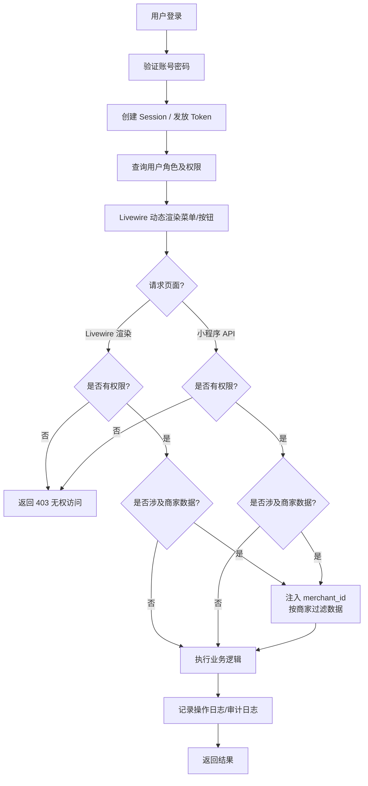

### 8.2 商品管理流程

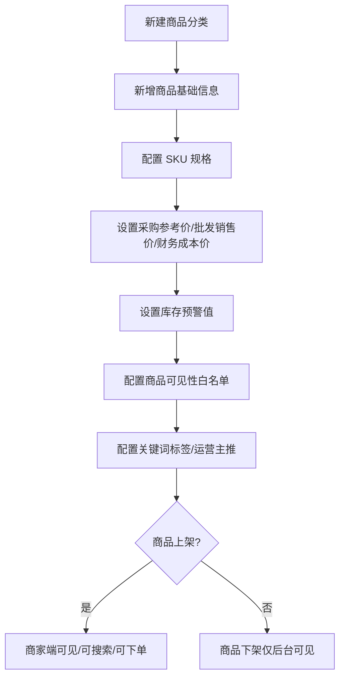

### 8.3 库存管理流程

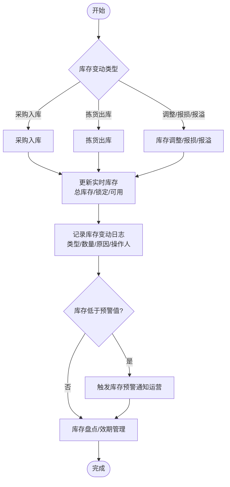

### 8.4 拣货管理流程

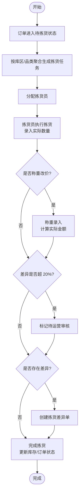

### 8.5 物流配送流程

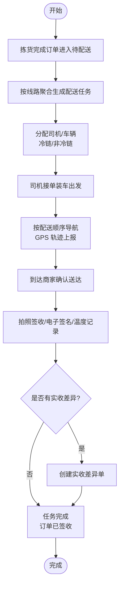

### 8.6 差异处理流程

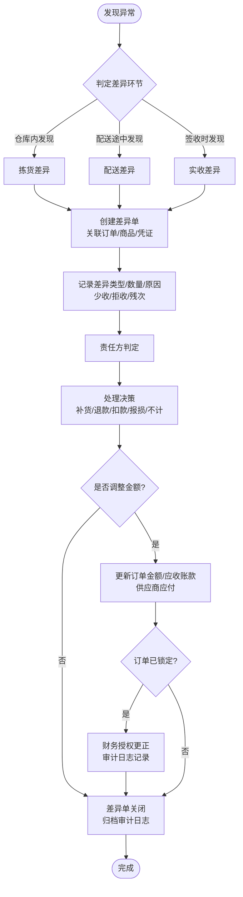

### 8.7 财务结算流程

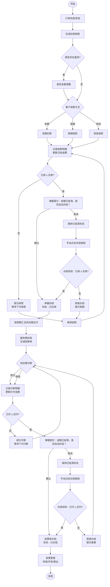

### 8.8 微信小程序商家端流程

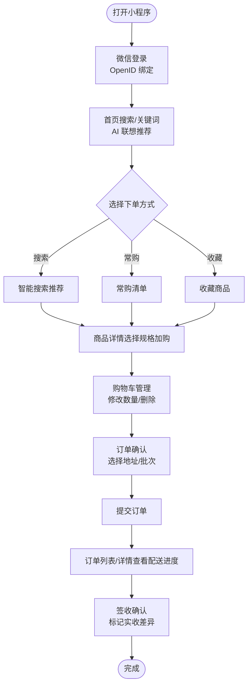

### 8.9 微信小程序司机端流程

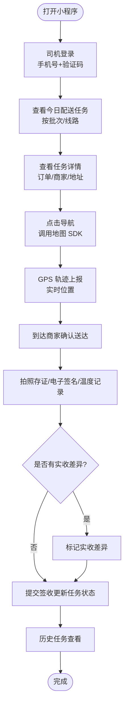

### 8.10 价格策略流程

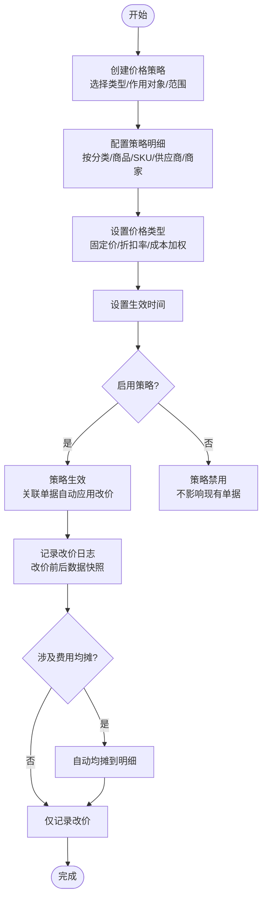

### 8.11 采购退货流程

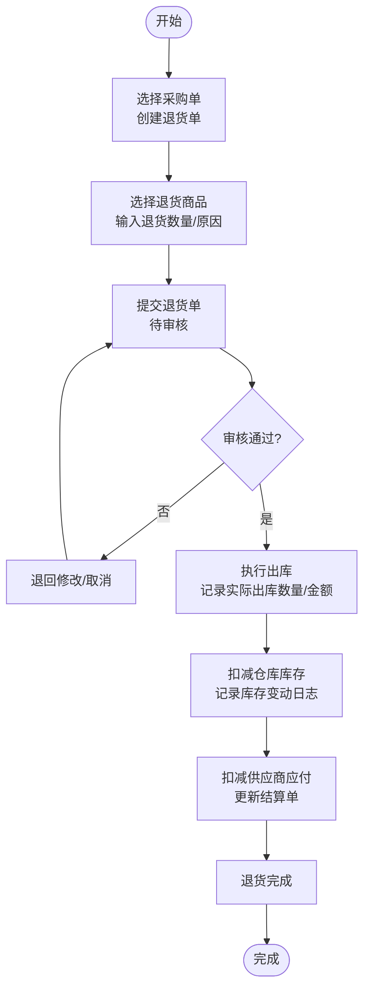

### 8.12 售后退货流程

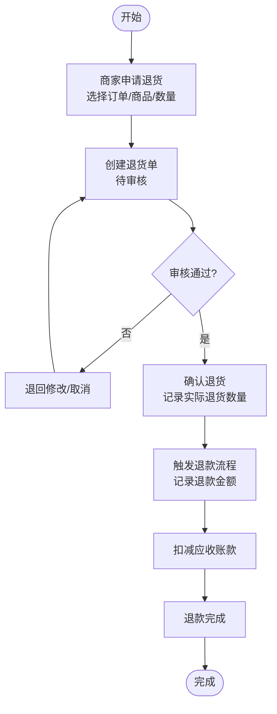

### 8.13 费用均摊流程

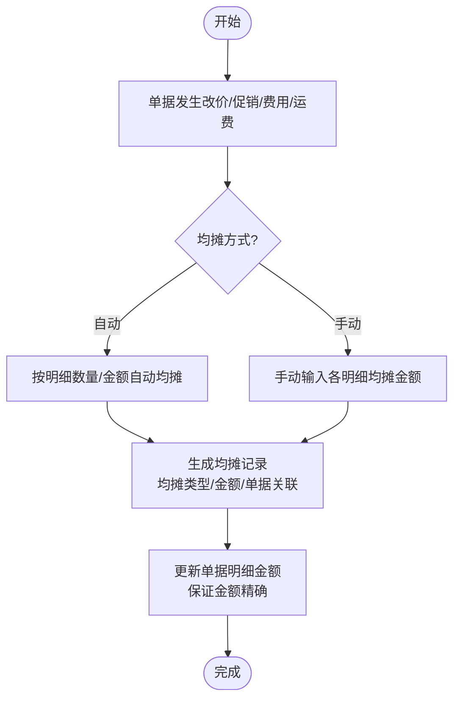

### 8.14 损耗管理流程

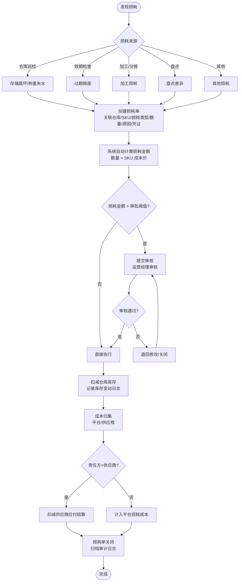

### 8.15 流程图源文件清单

> 以下 `.drawio` 源文件位于 `docs/flowcharts/draw 03/` 目录，主合并文件为 `docs/flowcharts/draw 03.drawio`，可用 [draw.io / diagrams.net](https://app.diagrams.net) 打开修改。

| 文件名 | 对应模块 | 主要用途 |
| :--- | :--- | :--- |
| `01_整体系统业务架构图.drawio` | 全局架构 | 系统架构评审、技术选型说明 |
| `02_平台统采流程.drawio` | 2.4 平台统采模块 | 采购/入库开发 |
| `03_客户直采流程.drawio` | 2.5 客户直采模块 | 订单全生命周期开发 |
| `04_智能下单流程.drawio` | 3 微信小程序商家端 | 智能搜索/推荐下单开发 |
| `05_差异处理流程.drawio` | 2.9 差异处理模块 | 差异单与审计开发 |
| `06_条码管理流程.drawio` | 2.3 商品管理模块 | 条码/一品多供/扫码识别开发 |
| `07_财务结算流程.drawio` | 2.10 财务对账模块 | 应收/供应商结算开发 |
| `08_库存管理流程.drawio` | 2.6 库存管理模块 | 库存/预警/日志开发 |
| `09_拣货管理流程.drawio` | 2.7 拣货管理模块 | 拣货任务/称重改价开发 |
| `10_物流配送流程.drawio` | 2.8 物流配送模块 | 配送任务/签收开发 |
| `11_微信小程序商家端流程.drawio` | 3 微信小程序商家端 | 小程序商家端 UX |
| `12_微信小程序司机端流程.drawio` | 4 微信小程序司机端 | 小程序司机端 UX |
| `13_权限与数据隔离流程.drawio` | 2.1 用户与权限管理模块 | RBAC/数据隔离实现 |
| `14_商品管理流程.drawio` | 2.3 商品管理模块 | 分类/SKU/条码/一品多供/可见性/标签开发 |
| `15_损耗管理流程.drawio` | 2.14 损耗管理模块 | 损耗单/审批阈值/库存扣减/成本归集开发 |
| `16_价格策略流程.drawio` | 2.12 价格策略模块 | 促销/临时改价/审核/改价记录/费用均摊开发 |
| `17_退货管理流程.drawio` | 2.4+2.5 退货（采购+售后） | 采购退货/出库/扣减/售后退货/退款开发 |
| `18_审核管理流程.drawio` | 2.15 审核管理模块 | 19个审核节点统一流转/开关/审计开发 |
| `19_用户与权限管理流程.drawio` | 2.1 用户与权限管理模块 | 角色/权限/用户/登录/数据隔离全流程开发 |

> AI生成

---

## 9 项目目录规划

> 本章定义三端（管理后台 Web、商家端小程序、司机端小程序）及 Laravel 后端的完整目录结构，按业务模块组织，指导团队统一开发规范。
>
> **关键变更说明**：项目采用单仓结构，Laravel 应用根目录即项目根目录，不再使用 `backend/` 子目录嵌套。小程序端后续独立仓库。

### 9.1 总体仓库结构

```text
susong-livewire/                  ← 项目根目录（= Laravel 应用根目录）
├── app/                          ← Laravel 应用核心代码
├── bootstrap/                    ← 框架启动引导
├── config/                       ← 配置文件
├── database/                     ← 迁移 + 种子 + 工厂
├── docs/                         ← 设计文档（7 份 + 流程图 + 附件）
├── public/                       ← Web 入口 + 编译产物
├── resources/                    ← 前端资源（CSS/JS/Blade 视图）
├── routes/                       ← 路由定义
├── storage/                      ← 日志/缓存/上传文件
├── tests/                        ← 自动化测试（Pest）
├── .env                          ← 环境配置（不入版本控制）
├── .env.example                  ← 环境配置模板
├── composer.json                 ← PHP 依赖
├── package.json                  ← 前端依赖
├── vite.config.js                ← Vite 构建配置
├── artisan                       ← Laravel CLI 入口
└── README.md                     ← 项目说明
```

**小程序端独立仓库（后续创建）：**

| 端 | 仓库名 | 技术栈 |
|:---|:---|:---|
| 商家端 | `susong-mini-merchant` | Taro 4 + React + TypeScript |
| 司机端 | `susong-mini-driver` | 原生微信小程序 |

---

### 9.2 Laravel 后端目录规划（app/）

> 按实际 Laravel 13 Starter Kit 结构 + 业务扩展规划。当前为初始化状态，标注 **[待建]** 表示开发迭代中需创建。

```text
app/
├── Http/
│   ├── Controllers/
│   │   └── Controller.php                          # 基类控制器（Laravel 自带）
│   │
│   └── Middleware/                                  # 自定义中间件 [待建]
│       ├── CheckPermission.php                     # 权限校验
│       ├── CheckApprovalEnabled.php                # 审核节点开关检查
│       └── LogOperation.php                        # 操作日志自动记录
│
├── Livewire/                                       # Livewire 组件（管理后台）[待建]
│   ├── Auth/
│   │   └── Login.php                               # 登录页
│   ├── User/                                       # 用户与权限
│   │   ├── UserList.php
│   │   ├── UserForm.php
│   │   ├── RoleList.php
│   │   ├── RoleForm.php
│   │   ├── PermissionList.php
│   │   └── PermissionForm.php
│   ├── Org/                                        # 组织主体
│   │   ├── SupplierList.php
│   │   ├── SupplierForm.php
│   │   ├── MerchantList.php
│   │   ├── MerchantForm.php
│   │   ├── RouteList.php
│   │   ├── RouteSort.php                           # 看板拖拽排序
│   │   ├── DriverList.php
│   │   ├── DriverForm.php
│   │   ├── VehicleList.php
│   │   └── VehicleForm.php
│   ├── Product/                                    # 商品管理
│   │   ├── CategoryList.php
│   │   ├── ProductList.php
│   │   ├── ProductForm.php
│   │   ├── SkuForm.php
│   │   ├── BarcodeForm.php
│   │   ├── SkuSupplierForm.php
│   │   ├── VisibilityConfig.php
│   │   ├── TagList.php
│   │   └── KeywordList.php
│   ├── Purchase/                                   # 平台统采
│   │   ├── PurchaseItemList.php
│   │   ├── PurchaseOrderList.php
│   │   ├── PurchaseOrderDetail.php
│   │   ├── PurchaseReturnList.php
│   │   └── PurchaseReturnDetail.php
│   ├── Order/                                      # 客户直采
│   │   ├── CartList.php
│   │   ├── OrderList.php
│   │   ├── OrderDetail.php
│   │   ├── WeighingPriceForm.php
│   │   ├── FrequentlyBoughtList.php
│   │   ├── RepurchaseList.php
│   │   ├── OrderReturnList.php
│   │   └── OrderReturnDetail.php
│   ├── Inventory/                                  # 库存管理
│   │   ├── WarehouseList.php
│   │   ├── InventoryList.php
│   │   ├── InventoryAdjustForm.php
│   │   └── InventoryLogList.php
│   ├── Loss/                                       # 损耗管理
│   │   ├── LossOrderList.php
│   │   ├── LossOrderDetail.php
│   │   ├── LossOrderForm.php
│   │   └── LossReport.php
│   ├── Picking/                                    # 拣货管理
│   │   ├── PickingTaskList.php
│   │   └── PickingTaskDetail.php
│   ├── Delivery/                                   # 物流配送
│   │   ├── DeliveryTaskList.php
│   │   ├── DeliveryTaskDetail.php
│   │   ├── TrackMap.php
│   │   ├── SignatureList.php
│   │   └── TemperatureList.php
│   ├── Discrepancy/                                # 差异处理
│   │   ├── DiscrepancyList.php
│   │   ├── DiscrepancyDetail.php
│   │   └── DiscrepancyReport.php
│   ├── Finance/                                    # 财务对账
│   │   ├── MerchantAccountList.php
│   │   ├── RechargeList.php
│   │   ├── RechargeForm.php
│   │   ├── SettlementList.php
│   │   ├── SettlementDetail.php
│   │   ├── PaymentForm.php
│   │   ├── ReceivableList.php
│   │   ├── ReceivableDetail.php
│   │   ├── ReceivablePaymentForm.php
│   │   ├── InvoiceList.php
│   │   ├── CorrectionList.php
│   │   └── ApportionmentList.php
│   ├── Price/                                      # 价格策略
│   │   ├── PriceStrategyList.php
│   │   ├── PriceStrategyForm.php
│   │   └── PriceChangeLogList.php
│   ├── Approval/                                   # 审核管理
│   │   ├── ApprovalConfig.php
│   │   ├── ApprovalPendingList.php
│   │   └── ApprovalReviewedList.php
│   └── System/                                     # 系统支撑
│       ├── SystemConfig.php
│       ├── BannerList.php
│       ├── PromotionList.php
│       ├── OperationLogList.php
│       ├── AuditLogList.php
│       └── LoginLogList.php
│
├── Models/                                         # Eloquent 模型 [待建]
│   ├── User.php                                    # 已存在（Starter Kit 自带）
│   ├── Role.php
│   ├── Permission.php
│   ├── Supplier.php
│   ├── Merchant.php
│   ├── MerchantAddress.php
│   ├── DeliveryRoute.php
│   ├── Driver.php
│   ├── Vehicle.php
│   ├── DriverVehicle.php
│   ├── Category.php
│   ├── Product.php
│   ├── ProductImage.php
│   ├── Sku.php
│   ├── SkuBarcode.php
│   ├── SkuSupplier.php
│   ├── MerchantSkuVisibility.php
│   ├── Tag.php
│   ├── ProductTag.php
│   ├── Keyword.php
│   ├── PurchaseItem.php
│   ├── PurchaseOrder.php
│   ├── PurchaseOrderItem.php
│   ├── PurchaseReturn.php
│   ├── PurchaseReturnItem.php
│   ├── Cart.php
│   ├── CartItem.php
│   ├── Order.php
│   ├── OrderItem.php
│   ├── FrequentlyBought.php
│   ├── RepurchaseTemplate.php
│   ├── RepurchaseTemplateItem.php
│   ├── OrderReturn.php
│   ├── OrderReturnItem.php
│   ├── Warehouse.php
│   ├── Inventory.php
│   ├── InventoryLog.php
│   ├── LossOrder.php
│   ├── LossOrderItem.php
│   ├── PickingTask.php
│   ├── PickingTaskItem.php
│   ├── DeliveryTask.php
│   ├── DeliveryTaskOrder.php
│   ├── DeliveryTrack.php
│   ├── Signature.php
│   ├── Temperature.php
│   ├── Discrepancy.php
│   ├── MerchantAccount.php
│   ├── Recharge.php
│   ├── SupplierSettlement.php
│   ├── SupplierSettlementItem.php
│   ├── SettlementPayment.php
│   ├── Receivable.php
│   ├── ReceivablePayment.php
│   ├── Invoice.php
│   ├── CorrectionAuthorization.php
│   ├── PriceStrategy.php
│   ├── PriceStrategyItem.php
│   ├── PriceChangeLog.php
│   ├── PriceApportionment.php
│   ├── SystemConfig.php
│   ├── Banner.php
│   ├── Promotion.php
│   ├── OperationLog.php
│   ├── AuditLog.php
│   ├── LoginLog.php
│   ├── WechatUser.php
│   ├── Notification.php
│   ├── RestockReminder.php
│   ├── MerchantFavorite.php
│   ├── Approval.php
│   └── ApprovalTypeConfig.php
│
├── Services/                                       # 业务逻辑服务层 [待建]
│   ├── AuthService.php                             # 认证逻辑（登录/登出/Session + Token）
│   ├── PermissionService.php                      # 权限缓存 + 菜单渲染
│   ├── PurchaseService.php                         # 采购单生成 + 待采汇总
│   ├── OrderService.php                            # 订单创建 + 称重改价 + 锁定
│   ├── InventoryService.php                        # 库存变动 + 预警 + 日志
│   ├── LossOrderService.php                        # 损耗单 + 阈值判断 + 库存扣减
│   ├── PickingService.php                          # 拣货任务生成 + 差异
│   ├── DeliveryService.php                         # 配送任务 + 轨迹 + 签收
│   ├── DiscrepancyService.php                      # 差异单 + 金额调整
│   ├── SettlementService.php                       # 供应商结算 + 付款 + 办结
│   ├── ReceivableService.php                       # 应收 + 收款 + 办结
│   ├── RechargeService.php                         # 充值 + 审核入账
│   ├── ApprovalService.php                         # 统一审核引擎（19 节点）
│   ├── PriceStrategyService.php                    # 策略匹配 + 改价 + 均摊
│   ├── ReturnService.php                           # 采购退货 + 售后退货
│   ├── ExportService.php                           # 报表导出（CSV/Excel）
│   └── WechatMiniService.php                       # 微信小程序登录/消息
│
├── Events/                                         # 广播事件（Reverb 驱动）[待建]
│   ├── OrderCreated.php                            # 订单创建 → 通知商家端 + 管理后台
│   ├── OrderStatusChanged.php                      # 订单状态变更 → 推送 orders.{merchant_id}
│   ├── InventoryWarning.php                        # 库存预警 → 推送 inventory.warning
│   ├── ApprovalPending.php                         # 审核待办 → 推送 approval.{role_id}
│   ├── ApprovalResolved.php                        # 审核完成 → 通知申请人
│   ├── DeliveryTrackUpdated.php                    # 配送轨迹更新 → 推送 delivery.{driver_id}
│   ├── DiscrepancyCreated.php                      # 差异单创建 → 推送 discrepancy.{merchant_id}
│   ├── LossOrderPending.php                         # 损耗待审核 → 推送 loss-order.pending
│   ├── RechargeCompleted.php                       # 充值完成 → 推送 recharge.{merchant_id}
│   └── SystemAnnouncement.php                      # 系统公告 → 推送 system.announcement
│
├── Observers/                                      # 模型事件观察者 [待建]
│   ├── OrderObserver.php                           # 订单状态变更 → 日志/通知
│   ├── InventoryObserver.php                       # 库存变动 → 预警检查
│   └── AuditLogObserver.php                        # 敏感模型变更 → 审计日志
│
├── Enums/                                          # 枚举常量（替代魔法数字）[待建]
│   ├── OrderStatus.php
│   ├── PurchaseOrderStatus.php
│   ├── LossOrderStatus.php
│   ├── LossType.php
│   ├── DiscrepancyStage.php
│   ├── DiscrepancyType.php
│   ├── DiscrepancyDecision.php
│   ├── ApprovalStatus.php
│   ├── SettlementStatus.php
│   ├── ReceivableStatus.php
│   ├── InventoryLogType.php
│   ├── ResponsibleParty.php
│   └── PriceStrategyType.php
│
├── Policies/                                       # 授权策略 [待建]
│   ├── UserPolicy.php
│   ├── OrderPolicy.php
│   ├── LossOrderPolicy.php
│   └── ApprovalPolicy.php
│
└── Providers/
    └── AppServiceProvider.php                      # 已存在（Starter Kit 自带）
```

#### 9.2.1 关键设计原则

| 原则 | 说明 |
|:---|:---|
| Livewire 组件瘦、Service 胖 | Livewire 组件仅做表单交互与页面渲染，核心逻辑写在 Service 层 |
| Form Object 校验入参 | 每个 Livewire 表单对应独立 Form Object，复用 Laravel 验证规则 |
| 枚举替代魔法数字 | 状态/类型字段全部使用 `app/Enums/` 下的枚举类 |
| 事件驱动异步 | 审批完成/库存预警等使用 Event + Queue 异步处理，广播走 Reverb |
| Observer 自动审计 | 敏感模型变更通过 Observer 自动写入 audit_logs |
| 看板拖拽使用 wire:sort | Livewire 4.x 内置 `wire:sort` + `wire:sort:group` 实现拖拽 |
| Blade 组件可组合 | 对标 shadcn/ui 可组合结构，业务页面只组装组件、不复制样式 |

---

### 9.3 配置与路由目录规划

#### 9.3.1 配置文件（config/）

```text
config/
├── app.php                     # 应用基础（时区、语言、别名）
├── auth.php                    # 认证配置（Guard：web=Session / sanctrum=Token）
├── cache.php                   # 缓存驱动（redis）
├── database.php                # 数据库连接（mysql）
├── filesystems.php             # 文件系统
├── logging.php                 # 日志通道（daily）
├── mail.php                    # 邮件
├── queue.php                   # 队列驱动（redis）
├── reverb.php                  # Reverb WebSocket 配置 [已发布]
├── services.php                # 第三方服务
└── session.php                 # 会话驱动（redis）
```

**后续按需新增：**

| 文件 | 用途 |
|:---|:---|
| `broadcasting.php` | 广播频道授权（`php artisan vendor:publish --tag=laravel-broadcasting`） |
| `sanctum.php` | Sanctum Token 认证配置 |
| `susong.php` | 项目自定义配置（业务常量、UI_SIZE 等） |

#### 9.3.2 路由定义（routes/）

```text
routes/
├── web.php                     # 管理后台路由（Livewire 自动注册 + 页面路由）
├── api.php                     # 小程序端 API 路由（按模块分组）[待建]
├── channels.php                # 广播频道授权（Private 频道权限校验）[待建]
└── console.php                 # 定时任务/命令行路由（Laravel Scheduler）
```

**路由规划（routes/api.php）** — 小程序端按模块分组，前缀 `/api/v1`：

```php
// ====== 商家端认证 ======
Route::prefix('v1/mini/merchant')->group(function () {
    Route::post('auth/login', [MerchantAuthController::class, 'login']);
    Route::middleware('auth:sanctum')->group(function () {
        Route::get('products', [MerchantProductController::class, 'index']);
        Route::apiResource('cart', MerchantCartController::class)->only(['index', 'store', 'update', 'destroy']);
        Route::apiResource('orders', MerchantOrderController::class)->only(['index', 'store', 'show']);
        Route::get('account', [MerchantAccountController::class, 'show']);
        // ...
    });
});

// ====== 司机端认证 ======
Route::prefix('v1/mini/driver')->group(function () {
    Route::post('auth/login', [DriverAuthController::class, 'login']);
    Route::middleware('auth:sanctum')->group(function () {
        Route::get('tasks', [DriverTaskController::class, 'index']);
        Route::post('tracks', [DriverTrackController::class, 'store']);
        // ...
    });
});

// ====== 广播频道授权 ======
Route::middleware('auth:sanctum')->post('/broadcasting/auth', [BroadcastController::class, 'auth']);
```

#### 9.3.3 数据库目录（database/）

```text
database/
├── migrations/                 # 迁移文件（按时间戳排序）
│   ├── 0001_01_01_000000_create_users_table.php      # Starter Kit 自带
│   ├── 0001_01_01_000001_create_cache_table.php      # Starter Kit 自带
│   ├── 0001_01_01_000002_create_jobs_table.php        # Starter Kit 自带
│   └── ...                                            # 业务迁移 [待建]
├── seeders/                    # 种子数据
│   ├── DatabaseSeeder.php                          # Starter Kit 自带
│   ├── RolePermissionSeeder.php                    # 角色 + 权限种子 [待建]
│   ├── ApprovalConfigSeeder.php                    # 19 个审核节点种子 [待建]
│   └── SystemConfigSeeder.php                      # 系统配置种子 [待建]
└── factories/                  # 模型工厂
    └── UserFactory.php                              # Starter Kit 自带
```

#### 9.3.4 Artisan 命令（admin:* 命令体系）

系统内置 8 条 `admin:*` 命令，用于运维管理、初始化安装和数据维护。命令文件位于 `app/Console/Commands/`，Laravel 13 自动发现注册。

| 命令 | 说明 | 关键参数 |
|:---|:---|:---|
| `admin:install` | 安装/初始化数据库 | `--with-test-data`（导入测试数据）、`--force`（不确认）、`--fresh`（清空重建） |
| `admin:fresh` | 清空并重建数据库（二次确认） | `--with-test-data`、`--force` |
| `admin:make-user` | 创建管理员账户 | `--name`、`--email`、`--password`、`--role=super-admin`、`--force` |
| `admin:create-user` | 创建普通用户 | `--name`、`--email`、`--password`、`--role`（交互选择 9 角色） |
| `admin:reset-password` | 重置用户密码 | `--email`、`--password` |
| `admin:backup` | 备份数据库（mysqldump） | `--path`、`--compress`、`--only-data`、`--only-structure` |
| `admin:roles` | 列出角色与权限 | `--with-users`（显示角色下用户） |
| `admin:status` | 系统状态检查 | 无（检查数据库/Redis/Reverb/队列/用户统计） |

**命令文件目录：**

```text
app/Console/Commands/
├── AdminMakeCommand.php           # admin:make-user
├── AdminCreateUserCommand.php     # admin:create-user
├── AdminInstallCommand.php        # admin:install
├── AdminBackupCommand.php         # admin:backup
├── AdminResetPasswordCommand.php  # admin:reset-password
├── AdminListRolesCommand.php      # admin:roles
├── AdminFreshCommand.php          # admin:fresh
└── AdminStatusCommand.php         # admin:status
```

**典型使用场景：**

```bash
# 首次部署安装（不含测试数据）
php artisan admin:install

# 首次部署安装（含测试数据）
php artisan admin:install --with-test-data

# 创建超级管理员（交互式）
php artisan admin:make-user

# 创建超级管理员（一行命令，CI/CD 用）
php artisan admin:make-user --name=Admin --email=admin@example.com --password=Secret123 --force

# 创建普通用户
php artisan admin:create-user

# 重置密码
php artisan admin:reset-password --email=admin@susong.com

# 备份数据库（压缩）
php artisan admin:backup --compress

# 查看角色
php artisan admin:roles --with-users

# 系统状态
php artisan admin:status

# 清空重建（危险，二次确认）
php artisan admin:fresh --with-test-data
```

---

### 9.4 管理后台前端目录规划（resources/）

> 管理后台前端全部集成在 Laravel 应用 `resources/` 中，不使用独立前端仓库。

```text
resources/
├── views/
│   ├── app.blade.php                              # 主布局（顶栏+侧边+内容+Alpine.js）[待建]
│   ├── components/                                # Blade 组件（对标 shadcn/ui 可组合结构）[待建]
│   │   ├── layout/
│   │   │   ├── app-layout.blade.php               # 主布局壳
│   │   │   ├── app-sidebar.blade.php              # 侧边菜单（角色动态渲染）
│   │   │   ├── app-header.blade.php               # 顶栏（面包屑+通知+用户）
│   │   │   └── notification-drawer.blade.php      # 通知面板（右侧 Drawer，Alpine.js）
│   │   │
│   │   ├── ui/                                    # 基础 UI 组件（shadcn/ui 风格）
│   │   │   ├── button.blade.php                   # 按钮（variant/size/loading/icon）
│   │   │   ├── input.blade.php                    # 输入框
│   │   │   ├── select.blade.php                   # 下拉选择
│   │   │   ├── textarea.blade.php                 # 多行文本
│   │   │   ├── checkbox.blade.php                 # 复选框
│   │   │   ├── radio.blade.php                    # 单选
│   │   │   ├── badge.blade.php                    # 状态标签
│   │   │   ├── alert.blade.php                    # 警告提示
│   │   │   ├── card.blade.php                     # 卡片（CardHeader+CardContent+CardFooter）
│   │   │   ├── table.blade.php                    # 数据表格（分页/筛选/排序）
│   │   │   ├── modal.blade.php                    # 弹窗/确认框
│   │   │   ├── drawer.blade.php                   # 抽屉面板
│   │   │   ├── tabs.blade.php                     # 标签页
│   │   │   ├── toast.blade.php                    # 轻提醒（Alpine.js 驱动）
│   │   │   ├── dropdown.blade.php                 # 下拉菜单
│   │   │   ├── pagination.blade.php               # 分页组件
│   │   │   ├── empty-state.blade.php              # 空状态
│   │   │   ├── stat-block.blade.php               # 数据统计块
│   │   │   ├── image-upload.blade.php             # 图片上传
│   │   │   ├── file-upload.blade.php              # 文件上传
│   │   │   ├── amount-input.blade.php             # 金额输入（精度控制）
│   │   │   ├── tree-select.blade.php              # 树形选择器
│   │   │   ├── date-range-picker.blade.php        # 日期范围选择
│   │   │   └── icon.blade.php                     # 图标（Lucide Blade 组件）
│   │   │
│   │   └── business/                              # 业务通用组件
│   │       ├── approval-dialog.blade.php          # 审核弹窗（通过/拒绝/备注）
│   │       ├── approval-status-badge.blade.php    # 审核状态标签
│   │       ├── merchant-select.blade.php          # 商家下拉选择
│   │       ├── supplier-select.blade.php          # 供应商下拉选择
│   │       ├── sku-select.blade.php               # SKU 选择器
│   │       ├── warehouse-select.blade.php         # 仓库选择
│   │       ├── route-select.blade.php             # 配送线路选择
│   │       ├── driver-select.blade.php            # 司机选择
│   │       ├── category-tree.blade.php            # 分类树
│   │       ├── permission-tree.blade.php          # 权限树
│   │       ├── amount-display.blade.php           # 金额展示（千分位+符号）
│   │       └── image-gallery.blade.php            # 图片查看器
│   │
│   └── livewire/                                  # Livewire 视图（按模块）[待建]
│       ├── auth/
│       │   └── login.blade.php
│       ├── user/
│       │   ├── user-list.blade.php
│       │   ├── user-form.blade.php
│       │   ├── role-list.blade.php
│       │   ├── role-form.blade.php
│       │   ├── permission-list.blade.php
│       │   └── permission-form.blade.php
│       ├── org/
│       │   ├── supplier-list.blade.php
│       │   ├── supplier-form.blade.php
│       │   ├── merchant-list.blade.php
│       │   ├── merchant-form.blade.php
│       │   ├── route-list.blade.php
│       │   ├── route-sort.blade.php               # wire:sort 拖拽排序
│       │   ├── driver-list.blade.php
│       │   ├── driver-form.blade.php
│       │   ├── vehicle-list.blade.php
│       │   └── vehicle-form.blade.php
│       ├── product/
│       │   ├── category-list.blade.php
│       │   ├── product-list.blade.php
│       │   ├── product-form.blade.php
│       │   ├── sku-form.blade.php
│       │   ├── barcode-form.blade.php
│       │   ├── sku-supplier-form.blade.php
│       │   ├── visibility-config.blade.php
│       │   ├── tag-list.blade.php
│       │   └── keyword-list.blade.php
│       ├── purchase/
│       │   ├── purchase-item-list.blade.php
│       │   ├── purchase-order-list.blade.php
│       │   ├── purchase-order-detail.blade.php
│       │   ├── purchase-return-list.blade.php
│       │   └── purchase-return-detail.blade.php
│       ├── order/
│       │   ├── cart-list.blade.php
│       │   ├── order-list.blade.php
│       │   ├── order-detail.blade.php
│       │   ├── frequently-bought-list.blade.php
│       │   ├── repurchase-list.blade.php
│       │   ├── order-return-list.blade.php
│       │   └── order-return-detail.blade.php
│       ├── inventory/
│       │   ├── warehouse-list.blade.php
│       │   ├── inventory-list.blade.php
│       │   ├── inventory-adjust-form.blade.php
│       │   └── inventory-log-list.blade.php
│       ├── loss/
│       │   ├── loss-order-list.blade.php
│       │   ├── loss-order-detail.blade.php
│       │   ├── loss-order-form.blade.php
│       │   └── loss-report.blade.php
│       ├── picking/
│       │   ├── picking-task-list.blade.php
│       │   └── picking-task-detail.blade.php
│       ├── delivery/
│       │   ├── delivery-task-list.blade.php
│       │   ├── delivery-task-detail.blade.php
│       │   ├── track-map.blade.php
│       │   ├── signature-list.blade.php
│       │   └── temperature-list.blade.php
│       ├── discrepancy/
│       │   ├── discrepancy-list.blade.php
│       │   ├── discrepancy-detail.blade.php
│       │   └── discrepancy-report.blade.php
│       ├── finance/
│       │   ├── merchant-account-list.blade.php
│       │   ├── recharge-list.blade.php
│       │   ├── settlement-list.blade.php
│       │   ├── settlement-detail.blade.php
│       │   ├── receivable-list.blade.php
│       │   ├── receivable-detail.blade.php
│       │   ├── invoice-list.blade.php
│       │   ├── correction-list.blade.php
│       │   └── apportionment-list.blade.php
│       ├── price/
│       │   ├── price-strategy-list.blade.php
│       │   ├── price-strategy-form.blade.php
│       │   └── price-change-log-list.blade.php
│       ├── approval/
│       │   ├── approval-config.blade.php
│       │   ├── approval-pending-list.blade.php
│       │   └── approval-reviewed-list.blade.php
│       └── system/
│           ├── system-config.blade.php
│           ├── banner-list.blade.php
│           ├── promotion-list.blade.php
│           ├── operation-log-list.blade.php
│           ├── audit-log-list.blade.php
│           └── login-log-list.blade.php
│
├── css/
│   └── app.css                                       # Tailwind CSS 入口 + CSS 变量主题（@import 'tailwindcss'）
│
└── js/
    └── app.js                                        # Laravel + Alpine.js + Echo 入口
```

**resources/js/app.js 需追加 Echo 初始化：**

```javascript
import './echo';   // Laravel Echo + Reverb 连接（待建）
```

**resources/js/echo.js 规划 [待建]：**

```javascript
import Echo from 'laravel-echo';
import Pusher from 'pusher-js';

window.Pusher = Pusher;
window.Echo = new Echo({
    broadcaster: 'reverb',
    key: import.meta.env.VITE_REVERB_APP_KEY,
    wsHost: import.meta.env.VITE_REVERB_HOST,
    wsPort: import.meta.env.VITE_REVERB_PORT ?? 8080,
    wssPort: import.meta.env.VITE_REVERB_PORT ?? 443,
    forceTLS: (import.meta.env.VITE_REVERB_SCHEME ?? 'https') === 'https',
    enabledTransports: ['ws', 'wss'],
});
```

---

### 9.5 公共目录与构建产物（public/）

```text
public/
├── build/                       # Vite 编译产物（自动生成，勿手动修改）
│   ├── assets/                  # JS/CSS/字体文件（带 hash）
│   ├── manifest.json            # 资源清单
│   └── fonts-manifest.json      # 字体清单
├── index.php                    # Laravel 入口
├── .htaccess                    # Apache 重写规则
├── favicon.ico
├── favicon.svg
└── robots.txt
```

---

### 9.6 文档目录（docs/）

```text
docs/
├── 01_PRD_业务需求.md
├── 02_FSD_功能详细说明.md
├── 03_DB_数据库设计&数据字典.md
├── 04_API_前后端接口文档.md
├── 05_Setup_安装部署配置手册.md
├── 06_Log_开发迭代日志.md
├── 07_Test_功能验收用例.md
├── 审核节点全景图.md
├── attach/                      # 附件
│   ├── .env.example
│   ├── DB数据字典.xlsx
│   ├── init.sql
│   ├── install.sh
│   ├── install.bat
│   └── 开发进度记录表.xlsx
└── flowcharts/                  # 业务流程图
    └── ...                      # Draw.io 源文件（19 张）
```

---

### 9.7 扩展包与前端依赖清单

#### 9.7.1 PHP 扩展包（composer.json）

| 包名 | 版本 | 类型 | 用途 |
|:---|:---|:---|:---|
| `laravel/framework` | ^13.17 | require | Laravel 主框架 |
| `livewire/livewire` | ^4.1 | require | 全栈响应式框架（管理后台 SSR） |
| `livewire/blaze` | ^1.0 | require | Livewire 编译优化 |
| `laravel/tinker` | ^3.0 | require | 交互式 REPL |
| `laravel/reverb` | ^1.11 | require | WebSocket 实时推送服务器 |
| `laravel/sanctum` | ^4.3 | require | API Token 认证（小程序端） |
| `spatie/laravel-permission` | ^8.3 | require | RBAC 角色权限管理 |
| `fakerphp/faker` | ^1.24 | require-dev | 测试数据生成 |
| `larastan/larastan` | ^3.9 | require-dev | PHP 静态分析 |
| `laravel/pint` | ^1.27 | require-dev | 代码格式化 |
| `pestphp/pest` | ^4.7 | require-dev | 测试框架 |

#### 9.7.2 前端依赖（package.json）

| 包名 | 版本 | 用途 |
|:---|:---|:---|
| `tailwindcss` | ^4.0.7 | CSS 工具框架 |
| `@tailwindcss/vite` | ^4.1.11 | Tailwind CSS Vite 插件 |
| `vite` | ^8.0.0 | 前端构建工具 |
| `laravel-vite-plugin` | ^3.1 | Laravel Vite 集成 |
| `laravel-echo` | ^2.4.0 | WebSocket 前端客户端 |
| `pusher-js` | ^8.6.0 | Reverb 兼容协议层 |
| `concurrently` | ^9.0.1 | 多进程并行启动 |

---

### 9.8 目录规划对照总表

| 端 | 目录 | 核心技术 | 页面数 | 组件数 |
|:---|:---|:---|:---|:---|
| Laravel 全栈（项目根目录） | `app/` + `resources/` | Laravel 13 + Livewire 4.x + Alpine.js + Tailwind CSS | 70+ Livewire 组件 | UI 20+ Blade + 业务 12 Blade |
| Taro 商家端 | 独立仓库 `susong-mini-merchant` | Taro 4 + React + TS | 13 | 9 |
| 原生司机端 | 独立仓库 `susong-mini-driver` | 原生微信小程序 | 8 | 5 |

### 9.9 模块↔目录↔组件↔路由↔视图 完整映射

| 业务模块 | Livewire 组件 | Service | Blade 视图 | API（小程序） | 路由 |
|:---|:---|:---|:---|:---|:---|
| 用户与权限 | UserList, UserForm, RoleList, RoleForm, PermissionList, PermissionForm | AuthService, PermissionService | user/ | MerchantAuthController | web + api/v1/mini/merchant |
| 组织主体 | SupplierList, SupplierForm, MerchantList, MerchantForm, RouteList, RouteSort, DriverList, DriverForm, VehicleList, VehicleForm | - | org/ | - | web |
| 商品管理 | CategoryList, ProductList, ProductForm, SkuForm, BarcodeForm, SkuSupplierForm, VisibilityConfig, TagList, KeywordList | - | product/ | MerchantProductController | web + api/v1/mini/merchant |
| 平台统采 | PurchaseItemList, PurchaseOrderList, PurchaseOrderDetail, PurchaseReturnList, PurchaseReturnDetail | PurchaseService | purchase/ | - | web |
| 客户直采 | CartList, OrderList, OrderDetail, FrequentlyBoughtList, RepurchaseList, OrderReturnList, OrderReturnDetail | OrderService | order/ | MerchantCartController, MerchantOrderController | web + api/v1/mini/merchant |
| 库存管理 | WarehouseList, InventoryList, InventoryAdjustForm, InventoryLogList | InventoryService | inventory/ | - | web |
| 损耗管理 | LossOrderList, LossOrderDetail, LossOrderForm, LossReport | LossOrderService | loss/ | - | web |
| 拣货管理 | PickingTaskList, PickingTaskDetail | PickingService | picking/ | - | web |
| 物流配送 | DeliveryTaskList, DeliveryTaskDetail, TrackMap, SignatureList, TemperatureList | DeliveryService | delivery/ | DriverTaskController | web + api/v1/mini/driver |
| 差异处理 | DiscrepancyList, DiscrepancyDetail, DiscrepancyReport | DiscrepancyService | discrepancy/ | - | web |
| 财务对账 | MerchantAccountList, RechargeList, RechargeForm, SettlementList, SettlementDetail, PaymentForm, ReceivableList, ReceivableDetail, ReceivablePaymentForm, InvoiceList, CorrectionList, ApportionmentList | SettlementService, ReceivableService, RechargeService | finance/ | MerchantAccountController | web + api/v1/mini/merchant |
| 价格策略 | PriceStrategyList, PriceStrategyForm, PriceChangeLogList | PriceStrategyService | price/ | - | web |
| 审核管理 | ApprovalConfig, ApprovalPendingList, ApprovalReviewedList | ApprovalService | approval/ | - | web |
| 系统支撑 | SystemConfig, BannerList, PromotionList, OperationLogList, AuditLogList, LoginLogList | - | system/ | - | web |

> AI生成
│   │   ├── Org/                                    # 组织主体
│   │   │   ├── SupplierList.php
│   │   │   ├── SupplierForm.php
│   │   │   ├── MerchantList.php
│   │   │   ├── MerchantForm.php
│   │   │   ├── RouteList.php
│   │   │   ├── RouteSort.php                       # 看板拖拽排序
│   │   │   ├── DriverList.php
│   │   │   ├── DriverForm.php
│   │   │   ├── VehicleList.php
│   │   │   └── VehicleForm.php
│   │   ├── Product/                                # 商品管理
│   │   │   ├── CategoryList.php
│   │   │   ├── ProductList.php
│   │   │   ├── ProductForm.php
│   │   │   ├── SkuForm.php
│   │   │   ├── BarcodeForm.php
│   │   │   ├── SkuSupplierForm.php
│   │   │   ├── VisibilityConfig.php
│   │   │   ├── TagList.php
│   │   │   └── KeywordList.php
│   │   ├── Purchase/                               # 平台统采
│   │   │   ├── PurchaseItemList.php
│   │   │   ├── PurchaseOrderList.php
│   │   │   ├── PurchaseOrderDetail.php
│   │   │   ├── PurchaseReturnList.php
│   │   │   └── PurchaseReturnDetail.php
│   │   ├── Order/                                  # 客户直采
│   │   │   ├── CartList.php
│   │   │   ├── OrderList.php
│   │   │   ├── OrderDetail.php
│   │   │   ├── WeighingPriceForm.php
│   │   │   ├── FrequentlyBoughtList.php
│   │   │   ├── RepurchaseList.php
│   │   │   ├── OrderReturnList.php
│   │   │   └── OrderReturnDetail.php
│   │   ├── Inventory/                              # 库存管理
│   │   │   ├── WarehouseList.php
│   │   │   ├── InventoryList.php
│   │   │   ├── InventoryAdjustForm.php
│   │   │   └── InventoryLogList.php
│   │   ├── Loss/                                   # 损耗管理
│   │   │   ├── LossOrderList.php
│   │   │   ├── LossOrderDetail.php
│   │   │   ├── LossOrderForm.php
│   │   │   └── LossReport.php
│   │   ├── Picking/                                # 拣货管理
│   │   │   ├── PickingTaskList.php
│   │   │   └── PickingTaskDetail.php
│   │   ├── Delivery/                               # 物流配送
│   │   │   ├── DeliveryTaskList.php
│   │   │   ├── DeliveryTaskDetail.php
│   │   │   ├── TrackMap.php
│   │   │   ├── SignatureList.php
│   │   │   └── TemperatureList.php
│   │   ├── Discrepancy/                            # 差异处理
│   │   │   ├── DiscrepancyList.php
│   │   │   ├── DiscrepancyDetail.php
│   │   │   └── DiscrepancyReport.php
│   │   ├── Finance/                                # 财务对账
│   │   │   ├── MerchantAccountList.php
│   │   │   ├── RechargeList.php
│   │   │   ├── RechargeForm.php
│   │   │   ├── SettlementList.php
│   │   │   ├── SettlementDetail.php
│   │   │   ├── PaymentForm.php
│   │   │   ├── ReceivableList.php
│   │   │   ├── ReceivableDetail.php
│   │   │   ├── ReceivablePaymentForm.php
│   │   │   ├── InvoiceList.php
│   │   │   ├── CorrectionList.php
│   │   │   └── ApportionmentList.php
│   │   ├── Price/                                  # 价格策略
│   │   │   ├── PriceStrategyList.php
│   │   │   ├── PriceStrategyForm.php
│   │   │   └── PriceChangeLogList.php
│   │   ├── Approval/                               # 审核管理
│   │   │   ├── ApprovalConfig.php
│   │   │   ├── ApprovalPendingList.php
│   │   │   └── ApprovalReviewedList.php
│   │   └── System/                                 # 系统支撑
│   │       ├── SystemConfig.php
│   │       ├── BannerList.php
│   │       ├── PromotionList.php
│   │       ├── OperationLogList.php
│   │       ├── AuditLogList.php
│   │       └── LoginLogList.php
│   │
│   ├── Models/                                 # Eloquent 模型（55+）
│   │   ├── User.php
│   │   ├── Role.php
│   │   ├── Permission.php
│   │   ├── Supplier.php
│   │   ├── Merchant.php
│   │   ├── MerchantAddress.php
│   │   ├── DeliveryRoute.php
│   │   ├── Driver.php
│   │   ├── Vehicle.php
│   │   ├── DriverVehicle.php
│   │   ├── Category.php
│   │   ├── Product.php
│   │   ├── ProductImage.php
│   │   ├── Sku.php
│   │   ├── SkuBarcode.php
│   │   ├── SkuSupplier.php
│   │   ├── MerchantSkuVisibility.php
│   │   ├── Tag.php
│   │   ├── ProductTag.php
│   │   ├── Keyword.php
│   │   ├── PurchaseItem.php
│   │   ├── PurchaseOrder.php
│   │   ├── PurchaseOrderItem.php
│   │   ├── PurchaseReturn.php
│   │   ├── PurchaseReturnItem.php
│   │   ├── Cart.php
│   │   ├── CartItem.php
│   │   ├── Order.php
│   │   ├── OrderItem.php
│   │   ├── FrequentlyBought.php
│   │   ├── RepurchaseTemplate.php
│   │   ├── RepurchaseTemplateItem.php
│   │   ├── OrderReturn.php
│   │   ├── OrderReturnItem.php
│   │   ├── Warehouse.php
│   │   ├── Inventory.php
│   │   ├── InventoryLog.php
│   │   ├── LossOrder.php
│   │   ├── LossOrderItem.php
│   │   ├── PickingTask.php
│   │   ├── PickingTaskItem.php
│   │   ├── DeliveryTask.php
│   │   ├── DeliveryTaskOrder.php
│   │   ├── DeliveryTrack.php
│   │   ├── Signature.php
│   │   ├── Temperature.php
│   │   ├── Discrepancy.php
│   │   ├── MerchantAccount.php
│   │   ├── Recharge.php
│   │   ├── SupplierSettlement.php
│   │   ├── SupplierSettlementItem.php
│   │   ├── SettlementPayment.php
│   │   ├── Receivable.php
│   │   ├── ReceivablePayment.php
│   │   ├── Invoice.php
│   │   ├── CorrectionAuthorization.php
│   │   ├── PriceStrategy.php
│   │   ├── PriceStrategyItem.php
│   │   ├── PriceChangeLog.php
│   │   ├── PriceApportionment.php
│   │   ├── SystemConfig.php
│   │   ├── Banner.php
│   │   ├── Promotion.php
│   │   ├── OperationLog.php
│   │   ├── AuditLog.php
│   │   ├── LoginLog.php
│   │   ├── WechatUser.php
│   │   ├── Notification.php
│   │   ├── RestockReminder.php
│   │   ├── MerchantFavorite.php
│   │   ├── Approval.php
│   │   └── ApprovalTypeConfig.php
│   │
│   ├── Services/                               # 业务逻辑服务层
│   │   ├── AuthService.php                     # 认证逻辑（登录/登出/Token）
│   │   ├── PermissionService.php               # 权限缓存 + 菜单渲染
│   │   ├── PurchaseService.php                  # 采购单生成 + 待采汇总
│   │   ├── OrderService.php                     # 订单创建 + 称重改价 + 锁定
│   │   ├── InventoryService.php                 # 库存变动 + 预警 + 日志
│   │   ├── LossOrderService.php                 # 损耗单 + 阈值判断 + 库存扣减
│   │   ├── PickingService.php                   # 拣货任务生成 + 差异
│   │   ├── DeliveryService.php                  # 配送任务 + 轨迹 + 签收
│   │   ├── DiscrepancyService.php               # 差异单 + 金额调整
│   │   ├── SettlementService.php                # 供应商结算 + 付款 + 办结
│   │   ├── ReceivableService.php                # 应收 + 收款 + 办结
│   │   ├── RechargeService.php                  # 充值 + 审核入账
│   │   ├── ApprovalService.php                  # 统一审核引擎（19 节点）
│   │   ├── PriceStrategyService.php             # 策略匹配 + 改价 + 均摊
│   │   ├── ReturnService.php                    # 采购退货 + 售后退货
│   │   ├── ExportService.php                    # 报表导出（CSV/Excel）
│   │   └── WechatMiniService.php                # 微信小程序登录/消息
│   │
│   ├── Middleware/
│   │   ├── CheckPermission.php            # 权限校验中间件
│   │   ├── CheckApprovalEnabled.php       # 审核节点开关检查
│   │   ├── LogOperation.php               # 操作日志自动记录
│   │   └── SetLocale.php                   # 多语言（预留）
│   │
│   └── Resources/                          # API 响应资源（小程序端按模块）
│       └── V1/
│           ├── MerchantProductResource.php
│           ├── MerchantCartResource.php
│           ├── MerchantOrderResource.php
│           ├── MerchantAccountResource.php
│           ├── DriverTaskResource.php
│           ├── ApprovalResource.php
│           └── NotificationResource.php
│   │
│   ├── Observers/                               # 模型事件观察者
│   │   ├── OrderObserver.php                   # 订单状态变更 → 日志/通知
│   │   ├── InventoryObserver.php               # 库存变动 → 预警检查
│   │   └── AuditLogObserver.php                # 敏感模型变更 → 审计日志
│   │
│   ├── Enums/                                   # 枚举常量（替代魔法数字）
│   │   ├── OrderStatus.php                     # 订单状态枚举
│   │   ├── PurchaseOrderStatus.php             # 采购单状态枚举
│   │   ├── LossOrderStatus.php                 # 损耗单状态枚举
│   │   ├── LossType.php                        # 损耗类型枚举
│   │   ├── DiscrepancyStage.php                # 差异环节枚举
│   │   ├── DiscrepancyType.php                 # 差异类型枚举
│   │   ├── DiscrepancyDecision.php             # 差异决策枚举
│   │   ├── ApprovalStatus.php                  # 审核状态枚举
│   │   ├── SettlementStatus.php                # 结算状态枚举
│   │   ├── ReceivableStatus.php                # 应收状态枚举
│   │   ├── InventoryLogType.php                # 库存变动类型枚举
│   │   ├── ResponsibleParty.php                # 责任方枚举
│   │   └── PriceStrategyType.php               # 价格策略类型枚举
│   │
│   ├── Policies/                                # 授权策略
│   │   ├── UserPolicy.php
│   │   ├── OrderPolicy.php
│   │   ├── LossOrderPolicy.php
│   │   └── ApprovalPolicy.php
│   │
│   └── Events/                                  # 事件（广播 + 队列驱动）
│       ├── OrderCreated.php                    # 订单创建 → 通知商家端 + 管理后台
│       ├── OrderStatusChanged.php              # 订单状态变更 → 推送 orders.{merchant_id}
│       ├── InventoryWarning.php                # 库存预警 → 推送 inventory.warning
│       ├── ApprovalPending.php                 # 审核待办 → 推送 approval.{role_id}
│       ├── ApprovalResolved.php               # 审核完成 → 通知申请人
│       ├── DeliveryTrackUpdated.php            # 配送轨迹更新 → 推送 delivery.{driver_id}
│       ├── DiscrepancyCreated.php              # 差异单创建 → 推送 discrepancy.{merchant_id}
│       ├── LossOrderPending.php                # 损耗待审核 → 推送 loss-order.pending
│       ├── RechargeCompleted.php               # 充值完成 → 推送 recharge.{merchant_id}
│       └── SystemAnnouncement.php              # 系统公告 → 推送 system.announcement
│
├── routes/
│   ├── web.php                                   # 管理后台路由（Livewire 自动注册）
│   ├── api.php                                    # 小程序端 API 路由（按模块分组）
│   └── channels.php                               # 广播频道授权（Private 频道权限校验）
│
├── database/
│   ├── migrations/                              # 22 个迁移文件（按时间戳排序）
│   └── seeders/
│       ├── DatabaseSeeder.php
│       ├── RolePermissionSeeder.php             # 角色 + 权限种子
│       ├── ApprovalConfigSeeder.php             # 19 个审核节点种子
│       └── SystemConfigSeeder.php               # 系统配置种子
│
├── config/
│   ├── auth.php
│   ├── sanctum.php
│   ├── database.php
│   ├── cache.php
│   ├── queue.php
│   ├── broadcasting.php                          # 广播配置（Reverb 驱动）
│   ├── filesystems.php
│   └── susong.php                               # 项目自定义配置
│
└── storage/
    └── logs/
        └── susong.log
```

#### 9.2.1 路由规划（routes/api.php）

路由按模块分组，前缀统一 `/api/v1`，认证路由使用 `sanctum` 中间件：

```php
// ====== 认证 ======
Route::post('auth/login', [AuthController::class, 'login']);
Route::post('auth/logout', [AuthController::class, 'logout'])->middleware('auth:sanctum');
Route::post('auth/refresh', [AuthController::class, 'refresh'])->middleware('auth:sanctum');

Route::middleware('auth:sanctum')->prefix('v1')->group(function () {

    // ====== 用户与权限 ======
    Route::apiResource('users', UserController::class);
    Route::post('users/{user}/reset-password', [UserController::class, 'resetPassword']);
    Route::apiResource('roles', RoleController::class);
    Route::post('roles/{role}/permissions', [RoleController::class, 'syncPermissions']);
    Route::apiResource('permissions', PermissionController::class);

    // ====== 组织主体 ======
    Route::apiResource('suppliers', SupplierController::class);
    Route::apiResource('merchants', MerchantController::class);
    Route::apiResource('merchants.addresses', MerchantAddressController::class)->shallow();
    Route::apiResource('delivery-routes', DeliveryRouteController::class);
    Route::apiResource('drivers', DriverController::class);
    Route::apiResource('vehicles', VehicleController::class);

    // ====== 商品管理 ======
    Route::apiResource('categories', CategoryController::class);
    Route::apiResource('products', ProductController::class);
    Route::apiResource('skus', SkuController::class);
    Route::apiResource('sku-barcodes', SkuBarcodeController::class);
    Route::apiResource('sku-suppliers', SkuSupplierController::class);
    Route::apiResource('merchant-sku-visibility', MerchantSkuVisibilityController::class);
    Route::apiResource('tags', TagController::class);
    Route::apiResource('keywords', KeywordController::class);

    // ====== 平台统采 ======
    Route::apiResource('purchase-items', PurchaseItemController::class);
    Route::post('purchase-items/generate-order', [PurchaseItemController::class, 'generateOrder']);
    Route::apiResource('purchase-orders', PurchaseOrderController::class);
    Route::post('purchase-orders/{id}/confirm-ship', [PurchaseOrderController::class, 'confirmShip']);
    Route::post('purchase-orders/{id}/confirm-warehouse', [PurchaseOrderController::class, 'confirmWarehouse']);
    Route::apiResource('purchase-returns', PurchaseReturnController::class);
    Route::post('purchase-returns/{id}/audit', [PurchaseReturnController::class, 'audit']);
    Route::post('purchase-returns/{id}/confirm-out', [PurchaseReturnController::class, 'confirmOut']);

    // ====== 客户直采 ======
    Route::apiResource('carts', CartController::class)->only(['index', 'destroy']);
    Route::apiResource('orders', OrderController::class);
    Route::post('orders/{id}/lock', [OrderController::class, 'lock']);
    Route::post('orders/{id}/weighing-price', [OrderController::class, 'weighingPrice']);
    Route::apiResource('frequently-bought', FrequentlyBoughtController::class)->only(['index']);
    Route::apiResource('repurchase-templates', RepurchaseController::class);
    Route::apiResource('order-returns', OrderReturnController::class);
    Route::post('order-returns/{id}/audit', [OrderReturnController::class, 'audit']);
    Route::post('order-returns/{id}/refund', [OrderReturnController::class, 'refund']);

    // ====== 库存管理 ======
    Route::apiResource('warehouses', WarehouseController::class);
    Route::apiResource('inventory', InventoryController::class)->only(['index', 'show', 'update']);
    Route::apiResource('inventory-logs', InventoryLogController::class)->only(['index']);

    // ====== 损耗管理 ======
    Route::apiResource('loss-orders', LossOrderController::class);
    Route::post('loss-orders/{id}/execute', [LossOrderController::class, 'execute']);
    Route::get('loss-orders/statistics', [LossOrderController::class, 'statistics']);
    Route::get('loss-orders/trend', [LossOrderController::class, 'trend']);
    Route::get('loss-orders/export', [LossOrderController::class, 'export']);

    // ====== 拣货管理 ======
    Route::apiResource('picking-tasks', PickingTaskController::class);
    Route::post('picking-tasks/{id}/assign', [PickingTaskController::class, 'assign']);
    Route::post('picking-tasks/{id}/pick', [PickingTaskController::class, 'pick']);

    // ====== 物流配送 ======
    Route::apiResource('delivery-tasks', DeliveryTaskController::class);
    Route::post('delivery-tasks/{id}/assign', [DeliveryTaskController::class, 'assign']);
    Route::post('delivery-tasks/{id}/start', [DeliveryTaskController::class, 'start']);
    Route::post('delivery-tasks/{id}/complete', [DeliveryTaskController::class, 'complete']);
    Route::apiResource('delivery-tracks', DeliveryTrackController::class)->only(['store', 'index']);
    Route::apiResource('signatures', SignatureController::class)->only(['store', 'index']);
    Route::apiResource('temperatures', TemperatureController::class)->only(['store', 'index']);

    // ====== 差异处理 ======
    Route::apiResource('discrepancies', DiscrepancyController::class);
    Route::post('discrepancies/{id}/handle', [DiscrepancyController::class, 'handle']);
    Route::post('discrepancies/{id}/approve', [DiscrepancyController::class, 'approve']);
    Route::get('discrepancies/statistics', [DiscrepancyController::class, 'statistics']);
    Route::get('discrepancies/export', [DiscrepancyController::class, 'export']);

    // ====== 财务对账 ======
    Route::apiResource('merchant-accounts', MerchantAccountController::class)->only(['index', 'show']);
    Route::apiResource('recharges', RechargeController::class);
    Route::post('recharges/{id}/audit', [RechargeController::class, 'audit']);
    Route::apiResource('supplier-settlements', SupplierSettlementController::class);
    Route::post('supplier-settlements/{id}/close', [SupplierSettlementController::class, 'close']);
    Route::apiResource('settlement-payments', SettlementPaymentController::class)->only(['store', 'index']);
    Route::apiResource('receivables', ReceivableController::class);
    Route::post('receivables/{id}/close', [ReceivableController::class, 'close']);
    Route::apiResource('receivable-payments', ReceivablePaymentController::class)->only(['store', 'index']);
    Route::apiResource('invoices', InvoiceController::class);
    Route::apiResource('correction-authorizations', CorrectionAuthorizationController::class);
    Route::apiResource('price-apportionments', PriceApportionmentController::class);

    // ====== 价格策略 ======
    Route::apiResource('price-strategies', PriceStrategyController::class);
    Route::apiResource('price-change-logs', PriceChangeLogController::class)->only(['index', 'show']);

    // ====== 审核管理 ======
    Route::get('approvals/config', [ApprovalController::class, 'configIndex']);
    Route::put('approvals/config/{id}', [ApprovalController::class, 'configUpdate']);
    Route::get('approvals/pending', [ApprovalController::class, 'pending']);
    Route::get('approvals/reviewed', [ApprovalController::class, 'reviewed']);
    Route::post('approvals/{id}/approve', [ApprovalController::class, 'approve']);
    Route::post('approvals/{id}/reject', [ApprovalController::class, 'reject']);
    Route::get('approvals/pending-count', [ApprovalController::class, 'pendingCount']);

    // ====== 系统支撑 ======
    Route::apiResource('system-configs', SystemConfigController::class)->only(['index', 'update']);
    Route::apiResource('banners', BannerController::class);
    Route::apiResource('promotions', PromotionController::class);
    Route::apiResource('operation-logs', OperationLogController::class)->only(['index']);
    Route::apiResource('audit-logs', AuditLogController::class)->only(['index', 'show']);
    Route::apiResource('login-logs', LoginLogController::class)->only(['index']);

    // ====== 文件上传 & 报表导出 ======
    Route::post('files/upload', [FileUploadController::class, 'upload']);
    Route::get('reports/export', [ReportExportController::class, 'export']);
});

// ====== 微信小程序商家端 ======
Route::prefix('v1/mini/merchant')->group(function () {
    Route::post('auth/login', [MiniApp\MerchantAuthController::class, 'login']);
    Route::middleware('auth:sanctum')->group(function () {
        Route::get('home', [MiniApp\MerchantHomeController::class, 'index']);
        Route::get('products', [MiniApp\MerchantProductController::class, 'index']);
        Route::get('products/{id}', [MiniApp\MerchantProductController::class, 'show']);
        Route::apiResource('cart', MiniApp\MerchantCartController::class)->only(['index', 'store', 'update', 'destroy']);
        Route::apiResource('orders', MiniApp\MerchantOrderController::class)->only(['index', 'store', 'show']);
        Route::post('orders/{id}/confirm-sign', [MiniApp\MerchantOrderController::class, 'confirmSign']);
        Route::get('account', [MiniApp\MerchantAccountController::class, 'show']);
        Route::post('account/recharge', [MiniApp\MerchantAccountController::class, 'recharge']);
        Route::apiResource('messages', MiniApp\MerchantMessageController::class)->only(['index', 'show']);
        Route::apiResource('restock-reminders', MiniApp\MerchantMessageController::class . '@reminders');
    });
});

// ====== 微信小程序司机端 ======
Route::prefix('v1/mini/driver')->group(function () {
    Route::post('auth/login', [MiniApp\DriverAuthController::class, 'login']);
    Route::middleware('auth:sanctum')->group(function () {
        Route::get('tasks', [MiniApp\DriverTaskController::class, 'index']);
        Route::get('tasks/{id}', [MiniApp\DriverTaskController::class, 'show']);
        Route::post('tasks/{id}/start', [MiniApp\DriverTaskController::class, 'start']);
        Route::post('tasks/{id}/arrive', [MiniApp\DriverTaskController::class, 'arrive']);
        Route::post('tasks/{id}/sign', [MiniApp\DriverTaskController::class, 'sign']);
        Route::post('tracks', [MiniApp\DriverTaskController::class, 'reportTrack']);
        Route::post('temperatures', [MiniApp\DriverTaskController::class, 'recordTemperature']);
        Route::post('discrepancies', [MiniApp\DriverTaskController::class, 'markDiscrepancy']);
        Route::get('history', [MiniApp\DriverHistoryController::class, 'index']);
    });
});
```

#### 9.2.2 关键设计原则

| 原则 | 说明 |
| :--- | :--- |
| Livewire 组件瘦、Service 胖 | Livewire 组件仅做表单交互与页面渲染，核心逻辑写在 Service 层 |
| Form Object 校验入参 | 每个 Livewire 表单对应独立 Form Object，复用 Laravel 验证规则 |
| 枚举替代魔法数字 | 状态/类型字段全部使用 `app/Enums/` 下的枚举类 |
| 事件驱动异步 | 审批完成/库存预警等使用 Event + Queue 异步处理 |
| Observer 自动审计 | 敏感模型变更通过 Observer 自动写入 audit_logs |
| 看板拖拽使用 wire:sort | Livewire 4.x 内置 `wire:sort` + `wire:sort:group` 实现拖拽 |
| Blade 组件可组合 | 对标 shadcn/ui 可组合结构，业务页面只组装组件、不复制样式 |

> AI生成